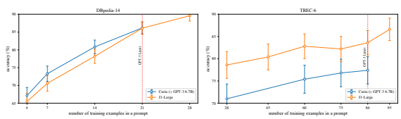

# Jurassic-1: Technical Details And Evaluation

WHITE PAPER

| Opher Lieber    | Or Sharir    | Barak Lenz      | Yoav Shoham    |
|-----------------|--------------|-----------------|----------------|
| AI21 Labs       | AI21 Labs    | AI21 Labs       | AI21 Labs      |
| opherl@ai21.com | ors@ai21.com | barakl@ai21.com | yoavs@ai21.com |

# A**Bstract**

Jurassic-1 is a pair of auto-regressive language models recently released by AI21 Labs, consisting of J1-Jumbo, a 178B-parameter model, and J1-Large, a 7B-parameter model. We describe their architecture and training, and evaluate their performance relative to GPT-3. The evaluation is in terms of perplexity, as well as zero-shot and few-shot learning. To that end, we developed a zeroshot and few-shot test suite, which we made publicly available (https://github.com/ai21labs/
lm-evaluation) as a shared resource for the evaluation of mega language models.

# 1 Introduction

AI21 Labs has recently released Jurassic-1, the first in a sequence of language models (LMs) that will be made available to the research and development community. To help developers assess the suitability of Jurassic-1 for their needs, this white paper provides technical details regarding its architecture and training, as well as an evaluation of its performance. We believe that radical advances in NLP call for innovations beyond increasing the network size, training data, and training time. But size does matter. Jurassic-1 is a set of baseline models, inspired by OpenAI's pioneering work on GPT-3 (Brown et al., 2020). Similar to GPT-3, Jurassic-1 consists of auto-regressive models trained on a mix of English corpora that scales up to 178B parameters. It diverges, however, from GPT-3 in several important respects, such as the size of vocabulary and the depth/width ratio of the neural net. We cover these architectural decisions in the next section.

In that section we also briefly discuss the training process, covering basic topics such as training corpus and length of training.1 Finally, we present our evaluation of the model, including a comparison with GPT-3. Evaluation of perplexity is straightforward. Evaluation of zero-shot learning requires specification, and evaluation of few-shot learning is notoriously tricky, being subject to the vagaries of prompt choice. We developed a zero-shot and few-shot evaluation suite which we found useful, and have posted the suite to GitHub (https://github.com/ai21labs/lm-evaluation) as a shared resource for the community for the evaluation of mega LMs.

# 2 Model And Training Details

In this section we describe the design choices behind our Jurassic-1 models. In sub-section 2.1 we describe the architecture that Jurassic-1 is based upon, how it differs from prior approaches, and how that translates into faster inference. In sub-section 2.2 we describe the vocabulary we developed for increasing the tokenization efficiency, thereby reducing the compute needed to process a given string of text, as well as providing a certain amount of semantic inductive bias. Last, in sub-section 2.3 we briefly describe how the model was trained.

1Training such a large model, on over 800 GPUs over many months, is a non-trivial engineering feat, and raises many issues not present in smaller models: Overflows, null attention heads, model and data parallelism that require solutions on top of packages such as DeepSpeed (Rasley et al., 2020), hardware failures, rigorous checkpointing, and more. These additional details are beyond the scope of this paper.

| Model       | nparams   | nlayers   | dmodel   | nheads   | dhead   | nvocab   |
|-------------|-----------|-----------|----------|----------|---------|----------|
| GPT\-3 6.7B | 6.7B      | 32        | 4096     | 32       | 128     | 50K      |
| J1\-Large   | 7.5B      | 32        | 4096     | 32       | 128     | 256K     |
| GPT\-3 175B | 175B      | 96        | 12288    | 96       | 128     | 50K      |
| J1\-Jumbo   | 178B      | 76        | 13824    | 96       | 144     | 256K     |

| Tokenizer        | nvocab   | Wikipedia   | OWT   | Books   | C4    | PileCC   | Avg.   | arXiv   | GitHub   | Avg.   |
|------------------|----------|-------------|-------|---------|-------|----------|--------|---------|----------|--------|
| T5's SP          | 32K      | 0.255       | 0.253 | 0.291   | 0.245 | 0.234    | 0.256  | 0.375   | 0.370    | 0.372  |
| GPT2/3's BPE     | 50K      | 0.223       | 0.217 | 0.253   | 0.216 | 0.225    | 0.227  | 0.333   | 0.405    | 0.369  |
| Jurassic\-1's SP | 256K     | 0.171       | 0.158 | 0.172   | 0.154 | 0.159    | 0.163  | 0.257   | 0.322    | 0.290  |

Table 1: Comparing the architecture of our Jurassic-1 models to their GPT-3 counterparts.

Table 2: Comparing the efficiency of different tokenizers on various corpora, as measured by the average tokens-perbytes (TPB) ratio, i.e., number of tokens divided by number of bytes in a sample from the corpus.

### 2.1 Architecture

We based our models on the decoder module of the Transformer architecture (Vaswani et al., 2017) with the modifications proposed by Radford et al. (2019). Input tokens are first converted to vector representation with an nvocab-by-dmodel embedding matrix (see following section for a further discussion), and then fed into the Transformer network. The architecture is composed of nlayers Transformer layers using a hidden dimension dmodel, each equipped with a selfattention module with nheads attention heads of size dhead and a feed-forward module. See prior works for specific details on inner-modules.

We targeted two model sizes that we call in short **J1-Large** (7.5B parameters) and **J1-Jumbo** (178B parameters), which roughly correspond to GPT-3 6.7B and GPT-3 175B models (as specified in Brown et al. (2020)), respectively. See Table 1 for exact specifications of both our Jurassic-1 models and their GPT-3 counterparts. For J1-Jumbo, we diverged from the Transformer architecture used by GPT-3 175B. Instead, we designed our architecture in light of a recently proposed theory (Levine et al., 2020) for the depth-to-width expressivity tradeoff found in selfattention networks. According to said theory, to leverage the full extent of the power brought by depth, the width must be chosen appropriately - put another way, for a given parameter budget there is an optimal depth. Specifically, for a parameter budget of 175B (not including embedding matrix), the optimal depth should be around 80 layers, far from the 96 layers used by GPT-3 175B. We put the theory to test and designed our J1-Jumbo with 76 layers. We used 76 rather than 80 layers because we also have to account for various hardware considerations during both training and inference. For example, the hidden dimension is constrained by the number of heads and their size, while dhead should be a multiple of 8 for optimal matrix-multiplication operations on GPUs and nheads should be divisible by the model parallelization factor. Similarly, the layers are divided into stages of equal compute needs for pipeline parallelization, introducing a constraint on nlayers as well. Beyond the potential advantages suggested by the theory, another byproduct of our refined architecture is a significant gain in runtime performance. By shifting compute resources from depth to width, more operations can be performed in parallel (width) rather than sequentially (depth). This is especially relevant to text generation where tokens are processed one at a time, and so there is less opportunity for parallelization, resulting in sub-optimal GPU utilization. In our benchmarks, comparing our architecture against GPT-3 175B on the same hardware configuration, our architecture has modest benefits in training time (1.5% speedup per iteration), but significant runtime gains in batch inference (7%)
and text generation (up to 23%).

### 2.2 Large Vocabulary For Tokenization Efficiency

The runtime for processing a raw string of text with a Transformer architecture is directly related to the number of tokens, denoted by N, the string is encoded into, roughly O(N) dense linear operations per Transformer layer and O(N2) for the self-attention operation. Given that, we investigate strategies to improve the tokens-per-word ratio, thereby reducing the cost for processing the text.

| Word\-Pieces   | Words                | Multi\-Word Expressions   |
|----------------|----------------------|---------------------------|
| z              | _cat                 | _ever_so_slightly         |
| _pre           | _descriptive         | _Tony_Stark               |
| ism            | _System.out.println  | _marketing_campaign       |
| tion           | _Pokemon             | _Higgs_boson              |
| \-ness         | _e.g.                | _production_capacity      |
| \-in\-law      |                      | _stepping_down            |
| \-on\-demand   | _https://github.com/ | _bank_accounts            |
| \-of\-the\-    | _LGBT                | _National_Public_Radio    |

Table 3: Examples of items from J1's vocabulary, including word-pieces, whole words, and multi-word expressions, where we use the more loose sense of a word as a sequences not containing whitespace in the middle of it. Underscore represent a literal space in the token.

Figure 1: An example showing how multi-word tokens and an overall larger vocabulary can better articulate the various

options the model considers at a given point in the text.

Two of the most common tokenizers used for LMs are GPT2/3's Bytes-Pair-Encoding (BPE) tokenizer (Sennrich et al., 2016; Radford et al., 2019; Brown et al., 2020) and T5's SentencePiece (SP) tokenizer (Kudo and Richardson, 2018; Raffel et al., 2020), each employing a token vocabulary of at most 50K tokens, where each token represents either a word or a word piece. GPT's BPE tokenizer is a bit more efficient than T5's SP on English text, with an average of 0.227 tokens per byte (TPB) vs. 0.256 for T5 (lower is better). In other domains, e.g., source-code or articles in LaTeX, both tokenizers are on par with 0.37 TPB. See Table 2 for per domain statistics. To represent text more efficiently, we trained a SP tokenizer with a larger budget of 256K vocabulary items and without restricting it to word boundaries. The resulting vocabulary contains a rich mixture of word pieces, whole words, and multi-word expressions, with a fallback to unicode bytes for out-of-vocabulary instances. There have been several prior works (Chen et al., 2016; Diao et al., 2020; Zhang et al., 2021) on utilizing larger vocabularies, or augmenting word vocabularies with phrase vocabularies, but increasing the token efficiency was not the focus of these earlier works, and this approach was never employed in models of Jurassic-1's scale (to the best of our knowledge).

The result of our improved tokenizer is a vastly more efficient text representation with a 0.163 TPB on English text and 0.29 on non-English domains (see Table 2 for full details). In other words, we can represent the same text with 28% fewer tokens than GPT-3, enabling us to process queries up to 1.4× faster when using the same architecture, and nearly 1.8× when accounting for the architectural speedups reported in the previous section. Alternatively, if we use the same maximal sequence length of 2048 tokens, we can represent 39% more text, allowing our model to cover more content during training and leverage longer prompts in few-shot settings. See section 3 for effect on few-shot performance.

Furthermore, by incorporating multi-word expressions into our vocabulary, it is more closely aligned with the semantic units of the text, including both named entities and common phrases (see examples in Table 3). Tokenizing according to the semantic units of the text has several advantages, such as more sample-efficient training (Levine et al., 2021), and more interpretable decoding, as illustrated in Figure 1.

Increasing the vocabulary does have some very minor drawbacks. Namely, it requires more memory to store the additional parameters of the vocabulary embedding layer, as well as more computing resources to calculate the token probabilities across the larger vocabulary. Yet, for large-scale LMs, these additional costs are negligible in comparison

| Corpus            | Curie (≈GPT\-3 6.7B)   | J1\-Large   | Davinci (≈GPT\-3 175B)   | J1\-Jumbo   |
|-------------------|------------------------|-------------|--------------------------|-------------|
| arXiv             | \-0.639                | \-0.515     | \-0.581                  | \-0.471     |
| Books3            | \-0.611                | \-0.628     | \-0.556                  | \-0.579     |
| C4                | \-0.547                | \-0.499     | \-0.501                  | \-0.455     |
| DM Math           | \-0.989                | \-0.734     | \-0.950                  | \-0.719     |
| Enron Emails      | \-0.718                | \-0.530     | \-0.664                  | \-0.431     |
| Freelaw           | \-0.470                | \-0.401     | \-0.424                  | \-0.356     |
| GitHub            | \-0.496                | \-0.307     | \-0.447                  | \-0.248     |
| Gutenberg         | \-0.873                | \-0.672     | \-0.806                  | \-0.617     |
| Hackernews        | \-0.726                | \-0.644     | \-0.676                  | \-0.602     |
| NIH Exporter      | \-0.462                | \-0.440     | \-0.424                  | \-0.409     |
| Open Subtitles    | \-0.695                | \-0.667     | \-0.646                  | \-0.609     |
| Phil Papers       | \-0.557                | \-0.571     | \-0.501                  | \-0.514     |
| PileCC            | \-0.534                | \-0.512     | \-0.484                  | \-0.464     |
| Pubmed Abstracts  | \-0.475                | \-0.441     | \-0.433                  | \-0.407     |
| Pubmed Central    | \-0.523                | \-0.433     | \-0.478                  | \-0.401     |
| StackExchange     | \-0.583                | \-0.494     | \-0.536                  | \-0.454     |
| Ubuntu IRC        | \-0.716                | \-0.644     | \-0.656                  | \-0.594     |
| USPTO             | \-0.426                | \-0.407     | \-0.392                  | \-0.372     |
| Youtube Subtitles | \-0.616                | \-0.620     | \-0.565                  | \-0.572     |
| Average           | \-0.613                | \-0.535     | \-0.564                  | \-0.488     |

Table 4: We report average log-probabilities per byte on variety of corpora (Raffel et al., 2020; Gao et al., 2020) to illustrate the suitability of our models on various domains. On almost all corpora our Jurassic-1 models are well ahead

of their GPT-3's counterparts.

with all the other layers. The vocabulary embedding for J1-Jumbo, for example, requires 3.6B parameters, which are just 2% of all parameters.

### 2.3 Training Details

Training models of these scales poses many engineering challenges because of their immense size. Simply storing 178B parameters requires more than 356GB of memory in half-precision, whereas even the largest GPUs available today have a maximum memory of 80GB, and this is before taking into account the optimizer's state or the intermediate calculations used by backward simulations. Therefore, training must be distributed across tens or hundreds of nodes, each with multiple GPUs, which presents its own set of challenges, e.g., loading and saving these huge checkpoints across many nodes creates communication bottlenecks. To utilize the available nodes efficiently, we relied on a combination of data, model, and pipeline parallelism strategies, as well as distributively sharding the optimizer's state parameters as proposed in Rajbhandari et al. (2020). We based our implementation on both DeepSpeed (Rasley et al., 2020) and MegatronLM (Narayanan et al., 2021). Our model was trained with the conventional self-supervised auto-regressive training objective on 300B tokens drawn from publicly available resources, attempting, in part, to replicate the structure of the training data as reported in Brown et al. (2020). As for the optimization procedure, here too we followed the hyper-parameters suggested in Brown et al.

(2020) for each corresponding model size. Namely, we used a base learning rate of 1.2 × 10−4and 0.6 × 10−4, and a batch size of 2M and 3.2M tokens, for J1-Large and J1-Jumbo, respectively. We also used a linear warm-up over roughly the first 375 million tokens, and gradually increased the batch size from 32K tokens up to its target value for the first few billion tokens.

# 3 Evaluation

Our Jurassic-1 models, as well as their GPT-3 counterparts, were extensively tested on a variety of tasks. As a first step, we discuss the model's ability to complete text across different domains. The ability to perform zero-shot learning is our primary criteria for evaluating the model's ability to solve a wide variety of tasks, since it is less vulnerable to prompt choice than the few-shot setting, and thus more stable and consistent. Finally, we demonstrate the few-shot capabilities of our model on select tasks. We find that in all cases our models perform either on par or better than their GPT-3 counterparts.

| Question Format   | Answer Format      | Newlines   | ARC\-Challenge   | ARC\-Easy   | RACE\-middle   | RACE\-high   |
|-------------------|--------------------|------------|------------------|-------------|----------------|--------------|
| Question:         | Answer:            | 1          | 48.1%            | 67.1%       | 56.6%          | 46.5%        |
| Question:         | Answer:            | 2          | 49.5%            | 67.0%       | 55.6%          | 45.5%        |
| question:         | answer:            | 1          | 48.5%            | 67.2%       | 56.3%          | 46.5%        |
| question:         | answer:            | 2          | 49.7%            | 68.0%       | 56.1%          | 46.4%        |
| Q:                | A:                 | 1          | 47.7%            | 66.1%       | 56.6%          | 45.9%        |
| Q:                | A:                 | 2          | 47.5%            | 66.9%       | 55.9%          | 45.7%        |
|                   | Standard Deviation |            | 0.90%            | 0.59%       | 0.39%          | 0.43%        |

| Task           | Test Size   | Curie (≈GPT\-3 6.7B)   | J1\-Large   | Davinci (≈GPT\-3 175B)   | J1\-Jumbo   |
|----------------|-------------|------------------------|-------------|--------------------------|-------------|
| ARC\-Challenge | 1172        | 41.7%                  | 41.7%       | 50.2%                    | 48.1%       |
| ARC\-Easy      | 2376        | 60.3%                  | 62.2%       | 69.2%                    | 67.1%       |
| BoolQ          | 3270        | 66.1%                  | 65.0%       | 75.9%                    | 73.5%       |
| HellaSwag      | 10042       | 68.4%                  | 71.9%       | 79.3%                    | 79.3%       |
| PIQA           | 1838        | 76.8%                  | 78.8%       | 80.1%                    | 81.4%       |
| RACE\-high     | 3498        | 42.5%                  | 43.1%       | 46.2%                    | 45.9%       |
| RACE\-middle   | 1436        | 53.2%                  | 53.9%       | 56.0%                    | 56.6%       |
| RTE            | 277         | 55.2%                  | 59.2%       | 57.4%                    | 62.8%       |
| StoryCloze     | 1871        | 77.6%                  | 80.2%       | 83.1%                    | 83.1%       |
| Winogrande     | 1267        | 64.5%                  | 64.4%       | 70.1%                    | 68.9%       |
| Average        |             | 60.6%                  | 62.0%       | 66.7%                    | 66.7%       |

Table 5: Variations in accuracy of question-answering tasks (using J1-Jumbo) due to minor format differences in how the question and answers are presented to the model, and the number of separating newlines. Results are based on our J1-Jumbo model, but similar variations occur in J1-Large as well as in GPT-3 models.

Table 6: Zero-shot results on a select set of tasks from Brown et al. (2020), according to the formats included in their paper.

For testing under these different settings, we developed our own evaluation suite, which we published at https:
//github.com/ai21labs/lm-evaluation. We utilized OpenAI's commercial API, notably its *Curie* and *Davinci* endpoints, to evaluate GPT-3 with our suite of tests. It is not specified in its documentation, but we estimated based on our experiments and their correlation to the results reported in Brown et al. (2020) that Curie corresponds to GPT-3 6.7B and that Davinci corresponds to GPT-3 175B. For the text completion evaluation, we measured the log-probability of a sample of documents of similar lengths from a given corpus, normalized by the number of bytes in the document in order to be tokenization independent. We tested on a variety of domains found in the Pile dataset (Gao et al., 2020), including web (Pile's Common Crawl corpus), academic text formatted in LaTeX (arXiv), fiction books (Books3, Gutenberg), computer programs (GitHub), and more. In all but three corpora, our Jurassic-1 models outperform their GPT-3 counterparts. See complete results in Table. 4. Our main evaluation is centered on zero-shot learning capabilities. Our decision to use zero-shot learning was driven by its simplicity and deterministic behavior, which does not depend on the selection of examples shown during few-shot learning. Nevertheless, the formatting of a task can have an impact on how well a model performs, as demonstrated in Table 5, where various forms of formatting question-answering tasks had a significant effect on the accuracy of the correct answer. As there is no standard benchmark for zero-shot performance, we tried to replicate the formats used by Brown et al. (2020) from the few examples in their figures. See the repository for our evaluation suite for the format specification we used. Our results on Curie and Davinci deviate slightly from those presented in Brown et al. (2020), perhaps due to the slight differences between formats used in presenting the task, and the possibilities that OpenAI's API is based on a slightly different set of models than those presented in Brown et al. (2020). Nevertheless, for the most part there is a strong correlation with the results reported in their paper, as mentioned above. When compared to our models, we see varied results, where on some tasks the Jurassic-1 models come ahead and in some GPT-3. On average, we see that both models attain the same performance. See complete results in Table. 6. While on zero-shot both GPT-3 and J1 attain on par results, the main advantage of J1 is that it reads text more efficiently.

One of its benefits is that in few-shot learning settings more training examples can fit in the prompt. Not every task requires many examples, and in some tasks adding too many could even hurt performance. In our experience, question-answering tasks usually need only a few examples. However, in many real-world scenarios, having more

Figure 2: Results for few-shot learning on the DBPedia-14 and TREC-6 text-classification tasks. The vertical line signify the maximal number of examples that would fit in the prompt for a GPT-3 model. As shown, J1-Large is able to attain better results by allowing for more training examples to fit in the prompt for the same number of tokens.

examples could have a significant impact on performance. This is especially true in cases where the task has many edge cases or is more fuzzily defined, and so many examples are needed to convey to the language model the expected result, e.g., paraphrasing sentences or summarizing a document. Since it can be difficult to consistently measure these kind of tasks without human evaluation, we instead turn to text-classification tasks over a large set of classes. When many classes are involved, more examples are needed to properly specify each class. We evaluated J1 and GPT-3 on two text-classification datasets, namely, DBPedia-14 and TREC-6. In both cases we see that the accuracy can be dramatically improved by adding more examples than can fit into GPT-3's context length. See our results in Figure 2. As a final remark, we wish to comment on the issue of bias and toxicity found in our model, as well as practically all language models in use today. As was observed in countless other works (Sheng et al., 2019; Bordia and Bowman, 2019; de Vassimon Manela et al., 2021; Nadeem et al., 2021), language models absorb biases and toxicity expressed in the texts they were trained on, and are prone to replicating them. Our model is no different, and indeed many language biases can be observed when using it, e.g., a doctor is more likely to be associated with the pronoun "he", while a nurse is more likely to be associated with the pronoun "she". See Table 7 for a thorough comparison of our models and their GPT3 counterparts on the StereoSet (Nadeem et al., 2021) bias benchmark. While it appears the Jurassic-1 models are marginally less biased than GPT3, this is merely one benchmark and we do not wish to overstate our claims. When these issues are carelessly ignored, employing language models could lead to unintended and discriminative consequences, and if deployed in widespread settings could cause actual harm to society. Many methods could be used to mitigate these issues, e.g., by carefully engineering prompts, or filtering suspected results - which we strongly recommend users of our models to adopt - but this is an active area of research (Sun et al., 2019; Bender et al., 2021) and the problem at large is far from solved. We are fully-committed to engaging with the community, constantly monitoring developments in this area, and incorporating such methods, as they become mature, into our models. We invite anyone interested in conducting research on or otherwise promoting AI ethics and safety to contact us at safety@ai21.com and explore opportunities for collaboration.

# 4 Summary

We released Jurassic-1, a pair of auto-regressive language models, including both the 178B-parameter J1-Jumbo, as well as its smaller sibling, J1-Large, with 7B parameters. The models utilize a more efficient architecture and tokenizer, which significantly speeds up inference. In addition, since our tokenizer can fit more text in the same context length, more examples can be included in few-shot learning settings. We evaluated our Jurassic-1 models on data completion, zero-shot learning and few-shot learning. Our zero-shot and few-shot evaluation code is made publicly available. We find that our Jurassic-1 models can predict text from a broader set of domains (web, academic, legal, source code, and more) than GPT-3, achieve comparable performance in zero-shot settings, and can be superior to GPT-3 in few-shot, due to their ability to fit more examples into a prompt.

# References

Tom Brown, Benjamin Mann, Nick Ryder, Melanie Subbiah, Jared D Kaplan, Prafulla Dhariwal, Arvind Neelakantan, Pranav Shyam, Girish Sastry, Amanda Askell, Sandhini Agarwal, Ariel Herbert-Voss, Gretchen Krueger, Tom Henighan, Rewon Child, Aditya Ramesh, Daniel Ziegler, Jeffrey Wu, Clemens Winter, Chris Hesse, Mark Chen, Eric Sigler, Mateusz Litwin, Scott Gray, Benjamin Chess, Jack Clark, Christopher Berner, Sam McCandlish, Alec

| Task            | Metric   | Curie (≈GPT\-3 6.7B)   | J1\-Large       | Davinci (≈GPT\-3 175B)   | J1\-Jumbo   |
|-----------------|----------|------------------------|-----------------|--------------------------|-------------|
|                 |          |                        | Intra\-Sentence |                          |             |
| Gender          | LM       | 92.7                   | 92.6            | 93.9                     | 92.9        |
|                 | SS       | 72.2                   | 72.1            | 73.3                     | 75.4        |
|                 | ICAT     | 51.6                   | 51.6            | 50.1                     | 45.7        |
| Profession      | LM       | 91.1                   | 91.7            | 91.9                     | 92.3        |
|                 | SS       | 65.3                   | 64.2            | 66.6                     | 67.0        |
|                 | ICAT     | 63.2                   | 65.7            | 61.4                     | 60.9        |
| Race            | LM       | 94.0                   | 93.6            | 94.0                     | 93.6        |
|                 | SS       | 64.6                   | 62.8            | 68.6                     | 65.6        |
|                 | ICAT     | 66.5                   | 69.7            | 59.0                     | 64.3        |
| Religion        | LM       | 92.0                   | 92.1            | 92.8                     | 91.4        |
|                 | SS       | 69.5                   | 65.2            | 65.8                     | 66.2        |
|                 | ICAT     | 56.2                   | 64.0            | 63.4                     | 61.8        |
| Intra\-Sentence | LM       | 92.7                   | 92.7            | 93.1                     | 92.9        |
| Overall         | SS       | 66.1                   | 64.6            | 68.3                     | 67.4        |
|                 | ICAT     | 62.9                   | 65.7            | 59.0                     | 60.6        |
|                 |          |                        | Inter\-Sentence |                          |             |
| Gender          | LM       | 83.7                   | 83.2            | 82.6                     | 80.9        |
|                 | SS       | 59.5                   | 58.9            | 63.2                     | 59.5        |
|                 | ICAT     | 67.9                   | 68.4            | 60.7                     | 65.4        |
| Profession      | LM       | 81.7                   | 80.8            | 78.3                     | 78.5        |
|                 | SS       | 56.9                   | 53.1            | 58.1                     | 56.5        |
|                 | ICAT     | 70.4                   | 75.7            | 65.7                     | 68.3        |
| Race            | LM       | 84.7                   | 82.8            | 83.1                     | 82.5        |
|                 | SS       | 51.6                   | 47.6            | 52.2                     | 50.6        |
|                 | ICAT     | 82.0                   | 78.8            | 79.4                     | 81.5        |
| Religion        | LM       | 87.1                   | 84.9            | 89.0                     | 85.2        |
|                 | SS       | 54.2                   | 53.2            | 52.9                     | 54.5        |
|                 | ICAT     | 79.8                   | 79.4            | 83.9                     | 77.5        |
| Inter\-Sentence | LM       | 83.5                   | 82.2            | 81.5                     | 80.8        |
| Overall         | SS       | 54.7                   | 51.3            | 55.9                     | 54.1        |
|                 | ICAT     | 75.7                   | 80.0            | 71.9                     | 74.2        |
| Overall Score   | LM       | 88.1                   | 87.4            | 87.3                     | 86.9        |
|                 | SS       | 60.4                   | 58.0            | 62.0                     | 60.7        |
|                 | ICAT     | 69.8                   | 73.5            | 66.3                     | 68.3        |

Table 7: A bias evaluation according to the StereoSet (Nadeem et al., 2021) benchmark, comparing the tendency of the model to prefer stereotypes to anti-stereotypes on various aspects (gender, profession, race, and religion). The evaluation is divided to inter-sentence and intra-sentence text-completion tasks. The LM Score measures the accuracy of an LM to prefer a relevant completion to a sentence over an unrelated completion. The SS Score measures the probability of an LM to prefer a stereotype completion to an anti-stereotype - an *ideal* score would be 50, signifying no bias either way. The ICAT Score is an aggregated score that is equal to ICAT = LMS ×
min(SS,100−SS)
50 , where 100 represents the ideal model. To accommodate for our multi-word tokenizer, we normalize log-probs of completions by number of characters rather than number of tokens, which we found to help GPT-3 models as well.

Radford, Ilya Sutskever, and Dario Amodei. Language models are few-shot learners. In H. Larochelle, M. Ranzato, R. Hadsell, M. F. Balcan, and H. Lin, editors, *Advances in Neural Information Processing Systems*, volume 33, pages 1877–1901. Curran Associates, Inc., 2020. URL https://proceedings.neurips.cc/paper/2020/file/ 1457c0d6bfcb4967418bfb8ac142f64a-Paper.pdf.

Jeff Rasley, Samyam Rajbhandari, Olatunji Ruwase, and Yuxiong He. Deepspeed: System optimizations enable training deep learning models with over 100 billion parameters. In *Proceedings of the 26th ACM SIGKDD International* Conference on Knowledge Discovery & Data Mining, KDD '20, page 3505–3506, New York, NY, USA, 2020. Association for Computing Machinery. ISBN 9781450379984. doi: 10.1145/3394486.3406703. URL https:
//doi.org/10.1145/3394486.3406703.

Ashish Vaswani, Noam Shazeer, Niki Parmar, Jakob Uszkoreit, Llion Jones, Aidan N Gomez, Ł ukasz Kaiser, and Illia Polosukhin. Attention is all you need. In I. Guyon, U. V. Luxburg, S. Bengio, H. Wallach, R. Fergus, S. Vishwanathan, and R. Garnett, editors, *Advances in Neural Information Processing Systems*, volume 30. Curran Associates, Inc., 2017. URL https://proceedings.neurips.cc/paper/2017/file/ 3f5ee243547dee91fbd053c1c4a845aa-Paper.pdf.

Alec Radford, Jeff Wu, Rewon Child, David Luan, Dario Amodei, and Ilya Sutskever. Language models are unsupervised multitask learners. 2019.

Yoav Levine, Noam Wies, Or Sharir, Hofit Bata, and Amnon Shashua. Limits to depth efficiencies of self-attention. In H. Larochelle, M. Ranzato, R. Hadsell, M. F. Balcan, and H. Lin, editors, Advances in Neural Information Processing Systems, volume 33, pages 22640–22651. Curran Associates, Inc., 2020. URL https://proceedings.neurips. cc/paper/2020/file/ff4dfdf5904e920ce52b48c1cef97829-Paper.pdf.

Rico Sennrich, Barry Haddow, and Alexandra Birch. Neural machine translation of rare words with subword units. In Proceedings of the 54th Annual Meeting of the Association for Computational Linguistics (Volume 1: Long Papers), pages 1715–1725, Berlin, Germany, August 2016. Association for Computational Linguistics. doi: 10.18653/v1/ P16-1162. URL https://www.aclweb.org/anthology/P16-1162.

Taku Kudo and John Richardson. SentencePiece: A simple and language independent subword tokenizer and detokenizer for neural text processing. In Proceedings of the 2018 Conference on Empirical Methods in Natural Language Processing: System Demonstrations, pages 66–71, Brussels, Belgium, November 2018. Association for Computational Linguistics. doi: 10.18653/v1/D18-2012. URL https://www.aclweb.org/anthology/D18-2012.

Colin Raffel, Noam Shazeer, Adam Roberts, Katherine Lee, Sharan Narang, Michael Matena, Yanqi Zhou, Wei Li, and Peter J. Liu. Exploring the limits of transfer learning with a unified text-to-text transformer. Journal of Machine Learning Research, 21(140):1–67, 2020. URL http://jmlr.org/papers/v21/20-074.html.

Wenlin Chen, David Grangier, and Michael Auli. Strategies for training large vocabulary neural language models. In Proceedings of the 54th Annual Meeting of the Association for Computational Linguistics (Volume 1: Long Papers), pages 1975–1985, Berlin, Germany, August 2016. Association for Computational Linguistics. doi: 10.18653/v1/ P16-1186. URL https://aclanthology.org/P16-1186.

Shizhe Diao, Jiaxin Bai, Yan Song, Tong Zhang, and Yonggang Wang. ZEN: Pre-training Chinese text encoder enhanced by n-gram representations. In *Findings of the Association for Computational Linguistics: EMNLP 2020*, pages 4729–4740, Online, November 2020. Association for Computational Linguistics. doi: 10.18653/v1/2020. findings-emnlp.425. URL https://aclanthology.org/2020.findings-emnlp.425.

Xinsong Zhang, Pengshuai Li, and Hang Li. Ambert: A pre-trained language model with multi-grained tokenization, 2021.

Yoav Levine, Barak Lenz, Opher Lieber, Omri Abend, Kevin Leyton-Brown, Moshe Tennenholtz, and Yoav Shoham.

{PMI}-masking: Principled masking of correlated spans. In *International Conference on Learning Representations*,
2021. URL https://openreview.net/forum?id=3Aoft6NWFej.

Samyam Rajbhandari, Jeff Rasley, Olatunji Ruwase, and Yuxiong He. Zero: Memory optimizations toward training trillion parameter models. In SC20: International Conference for High Performance Computing, Networking, Storage and Analysis, pages 1–16, 2020. doi: 10.1109/SC41405.2020.00024.

Deepak Narayanan, Mohammad Shoeybi, Jared Casper, Patrick LeGresley, Mostofa Patwary, Vijay Anand Korthikanti, Dmitri Vainbrand, Prethvi Kashinkunti, Julie Bernauer, Bryan Catanzaro, Amar Phanishayee, and Matei Zaharia. Efficient large-scale language model training on gpu clusters, 2021.

Leo Gao, Stella Biderman, Sid Black, Laurence Golding, Travis Hoppe, Charles Foster, Jason Phang, Horace He, Anish Thite, Noa Nabeshima, Shawn Presser, and Connor Leahy. The Pile: An 800gb dataset of diverse text for language modeling. *arXiv preprint arXiv:2101.00027*, 2020.

Moin Nadeem, Anna Bethke, and Siva Reddy. StereoSet: Measuring stereotypical bias in pretrained language models. In *Proceedings of the 59th Annual Meeting of the Association for Computational Linguistics and the* 11th International Joint Conference on Natural Language Processing (Volume 1: Long Papers), pages 5356–5371, Online, August 2021. Association for Computational Linguistics. doi: 10.18653/v1/2021.acl-long.416. URL https://aclanthology.org/2021.acl-long.416.

Emily Sheng, Kai-Wei Chang, Premkumar Natarajan, and Nanyun Peng. The woman worked as a babysitter: On biases in language generation. In *Proceedings of the 2019 Conference on Empirical Methods in Natural Language Processing* and the 9th International Joint Conference on Natural Language Processing (EMNLP-IJCNLP), pages 3407–3412, Hong Kong, China, November 2019. Association for Computational Linguistics. doi: 10.18653/v1/D19-1339. URL https://aclanthology.org/D19-1339.

Shikha Bordia and Samuel R. Bowman. Identifying and reducing gender bias in word-level language models. In Proceedings of the 2019 Conference of the North American Chapter of the Association for Computational Linguistics: Student Research Workshop, pages 7–15, Minneapolis, Minnesota, June 2019. Association for Computational Linguistics. doi: 10.18653/v1/N19-3002. URL https://aclanthology.org/N19-3002.

Daniel de Vassimon Manela, David Errington, Thomas Fisher, Boris van Breugel, and Pasquale Minervini. Stereotype and skew: Quantifying gender bias in pre-trained and fine-tuned language models. In Proceedings of the 16th Conference of the European Chapter of the Association for Computational Linguistics: Main Volume, pages 2232– 2242, Online, April 2021. Association for Computational Linguistics. URL https://aclanthology.org/2021. eacl-main.190.

Tony Sun, Andrew Gaut, Shirlyn Tang, Yuxin Huang, Mai ElSherief, Jieyu Zhao, Diba Mirza, Elizabeth Belding, Kai-Wei Chang, and William Yang Wang. Mitigating gender bias in natural language processing: Literature review. In *Proceedings of the 57th Annual Meeting of the Association for Computational Linguistics*, pages 1630–
1640, Florence, Italy, July 2019. Association for Computational Linguistics. doi: 10.18653/v1/P19-1159. URL
https://aclanthology.org/P19-1159.

Emily M. Bender, Timnit Gebru, Angelina McMillan-Major, and Shmargaret Shmitchell. On the dangers of stochastic parrots: Can language models be too big? In Proceedings of the 2021 ACM Conference on Fairness, Accountability, and Transparency, FAccT '21, page 610–623, New York, NY, USA, 2021. Association for Computing Machinery. ISBN 9781450383097. doi: 10.1145/3442188.3445922. URL https://doi.org/10.1145/3442188.3445922.