# To Infinity And Beyond: Show-1 And Showrunner

 Agents In Multi-Agent Simulations

| Edward Saatchi   | Pete Billington   | Jessica Yaffa Shamash   |
|------------------|-------------------|-------------------------|
| Fable Studio     | Fable Studio      | Fable Studio            |

| Philipp Maas   | Frank Carey   | Chris Wheeler   |
|----------------|---------------|-----------------|
| Fable Studio   | Fable Studio  | Fable Studio    |

# Abstract

1 In this work we present our approach to generating high-quality episodic content for 2 IP's (Intellectual Property) using large language models (LLMs), custom state-of3 the art diffusion models and our multi-agent simulation for contextualization, story 4 progression and behavioral control. Powerful LLMs such as GPT-4 were trained on 5 a large corpus of TV show data which lets us believe that with the right guidance 6 users will be able to rewrite entire seasons.*"That Is What Entertainment Will Look* 7 Like. Maybe people are still upset about the last season of Game of Thrones. 8 Imagine if you could ask your A.I. to make a new ending that goes a different way and maybe even put yourself in there as a main character or something.".

1 9

1Brockman https://www.hollywoodreporter.com/business/digital/chatgpt-game-of-thrones-openai-gregbrockman-1235348099/amp/

# 10 **1 Creative Limitations Of Existing Generative Ai Systems**

11 Current generative AI systems such as Stable Diffusion (Image Generator) and ChatGPT (Large 12 Language Model) excel at short-term general tasks through prompt engineering. However, they 13 do not provide contextual guidance or intentionality to either a user or a generative story system
(showrunner2 14 ) as part of a long-term creative process which is often essential to producing high-quality 15 creative works, especially in the context of existing IP's.

# 16 **1.1 Living With Uncertainty**

Figure 1: Example Still from South Park AI Episode

By using a multi-agent3 17 simulation as part of the process it's possible to make use of data points such 18 as a character's history, their goals and emotions, simulation events and localities to generate scenes 19 and image assets more coherently and consistently aligned with the IP story world. An IP-based 20 simulation provides a clear, well known context to the user which allows them to judge the generated 21 story more easily. Moreover, by allowing them to exert behavioral control over agents, observe their 22 actions and engage in interactive conversations, the user's expectations and intentions are formed 23 which we then funnel into a simple prompt to kick off the generation process. 24 The simulation has to be sufficiently complex and non-deterministic to favor a positive disconfirmation. 25 Amplification effects can help mitigate what we consider an undesired "slot machine" effect which 26 we'll briefly touch on later. We are used to watching episodes passively and the timespan between 27 input and "end of scene/episode" discourages immediate judgment by the user and as a result reduces 28 their desire to "retry". This disproportionality of the user's minimal input prompt and the resulting 29 high-quality long-form output in the form of a full episode is a key factor for positive disconfirmation.

30 While using and prompting a large language model as part of the process can introduce "several challenges".

4 31 , some of them like hallucinations, which introduce uncertainty or in more creative terms 32 "unexpectedness", can be regarded as creative side-effects to influence the expected story outcome in 33 positive ways. As long as the randomness introduced by hallucination does not lead to implausible plot or agent behavior and the system can recover, they act as happy-accidents5 34 , a term often used 35 during the creative process, further enhancing the user experience.

2https://fablesimulation.com/blog/friends-ai-sitcom-simulation 3Sung Park https://arxiv.org/abs/2304.03442 4Li https://arxiv.org/abs/2303.17760 5Maas https://noproscenium.com/from-a-i-character-to-sundance-filmmaker-with-gpt-3-d4ab80c31b4e

# 36 **1.2 The Issue Of 'The Slot Machine Effect' In Current Generative Ai Tools**

40 Current off-the-shelf generative AI systems do not support or encourage multiple creative evaluation

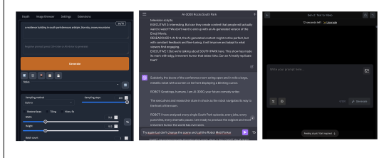 41 steps in context of a long-term creative goal. Their interfaces generally feature various settings, such 42 as sliders and input fields which increase the level control and variability. The final output however, 43 is generated almost instantaneously by the press of a button. This instantaneous generation process 44 results in immediate gratification providing a dopamine rush to the user. This reward mechanism 45 would be generally helpful to sustain a multi-step creative process over long periods of time but 46 current interfaces, the frequency of the reward and a lack of progression (stuck in an infinite loop)
can lead to negative effects such as frustration, the intention-action gap7 47 or a *loss of control over the* 48 *creative process. The gap results from behavioral bias favoring immediate gratification*, which can 49 be detrimental to long-term creative goals.

Figure 2: User Interface Comparison - Left to right: *Stable Diffusion Gradio, ChatGPT, Runway* Gen-2

# 64 **1.3 Large Language Models**

65 LLMs represent the forefront of natural language processing and machine learning research, demon66 strating exceptional capabilities in understanding and generating human-like text. They are typically 50 While we do not directly solve these issues through interfaces, the contextualization of the process 51 in a simulation and the above mentioned disproportionality and timespan between input and output 52 help mitigate them. In addition we see opportunities in the simulation for in-character discriminators 53 that participate in the creative evaluation process, such as an agent reflecting on the role they were 54 assigned to or a scene they should perform in. 55 The multi-step "trial and error" process of the proposed generative story system is not presented to the 56 user, therefore it doesn't allow for intervention or judgment, avoiding the negative effects of immediate 57 gratification through a user's "accept or reject" decisions. It does not matter to the user experience how often the AI system has to retry different prompt chains8 58 as long as the generation process is not 59 negatively perceived as idle time but integrated seamlessly with the simulation gameplay. The user 60 would only act as the discriminator at the end of the process after having watched the generated scene 61 or episode. This is also an opportunity to utilize the concept of Reinforcement Learning through 62 Human Feedback (RLHF) for improving the multi-step creative process and as a result automatically 63 generate full episodes in the future.

37 The Slot Machine Effect refers to a scenario where the *generation of AI-produced content feels more* like a random game of chance rather than a deliberate creative process6 38 . This is due to the often 39 unpredictable and instantaneous nature of the generation process.

6https://artificial.tech/slot-machine-effect-of-ai/
7https://thedecisionlab.com/reference-guide/psychology/intention-action-gap 8Yang https://arxiv.org/abs/2306.02224
built on Transformer-based architectures, a class of models that rely on self-attention 67 9 mechanisms.

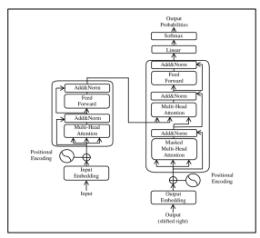

68 Transformers allow for efficient use of computational resources, enabling the training of significantly 69 larger language models. GPT-4, for instance, comprises billions of parameters that are trained on 70 extensive datasets, effectively encoding a substantial quantity of worldly knowledge in their weights.

Figure 3: Diagram of the Transformer Architecture10

86 As was mentioned previously, transformer-based language models excel at short-term general tasks.

They are regarded as fast-thinkers. [Kahneman]12 87 . Fast thinking pertains to instinctive, automatic, 88 and often heuristic-based decision-making, while slow thinking involves deliberate, analytical, and 89 effortful processes. LLMs generate responses swiftly based on patterns learned from training data, 90 without the capacity for introspection or understanding the underlying logic behind their outputs. 91 However, this also implies that LLMs lack the ability to deliberate, reason deeply, or learn from singular experiences13 92 in the way that slow-thinking entities, such as humans, can. While these 93 models have made remarkable strides in text generation tasks, their fast-thinking nature may limit 94 their potential in tasks requiring deep comprehension or flexible reasoning. More recent approaches 95 to imitate slow-thinking capabilities such as prompt-chaining (see Auto-GPT) showed promising 96 results. Large language models seem powerful enough to act as their own discriminator in a multi-step 71 Central to the functioning of these LLMs is the concept of vector embeddings. These are mathematical 72 representations of words or phrases in a high-dimensional space. These embeddings capture the 73 semantic relationships between words, such that words with similar meanings are located close to 74 each other in the embedding space. In the case of LLMs, each word in the model's vocabulary is 75 initially represented as a dense vector, also known as an embedding. These vectors are adjusted 76 during the training process, and their final values, or "embeddings", represent the learned relationships 77 between words. During training, the model learns to predict the next word in a sentence by adjusting 78 the embeddings and other parameters to minimize the difference between the predicted and actual 79 words. The embeddings thus reflect the model's understanding of words and their context. Moreover, 80 because Transformers can attend to any word in a sentence regardless of its position, the model 81 can form a more comprehensive understanding of the meaning of a sentence. This is a significant 82 advancement over older models that could only consider words in a limited window. The combination 83 of vector embeddings and Transformer-based architectures in LLMs facilitates a deep and nuanced 84 understanding of language, which is why these models can generate such high-quality, human-like 85 text.

9Vaswani https://arxiv.org/abs/1706.03762 10Vaswani https://arxiv.org/abs/1706.03762 11https://techcommunity.microsoft.com/t5/azure-data-explorer-blog/azure-data-explorer-for-vectorsimilarity-search/ba-p/3819626 12Bubeck https://arxiv.org/abs/2303.12712 13Bubeck https://arxiv.org/abs/2303.12712

Figure 4: Example of Text Vector Embedding11

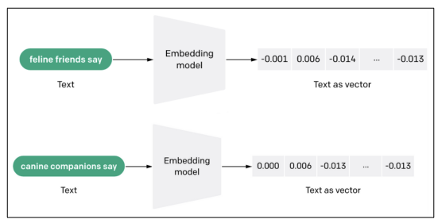

97 process. This can dramatically improve the ability to reason in different contexts, such as solving math problems.14 98 99 We make use of GPT-4 for the agents in the simulation as well as generating the scenes for the south 100 park episode. Since transcriptions of most of the south park episodes are part of GPT-4's training 101 dataset, it already has a good understanding of the character's personalities, talking style as well as 102 overall humor of the show, eliminating the need for a custom fine-tuned model. 103 We tried to imitate slow-thinking as part of a multi-step creative process. For this we used different 104 prompt chains to extrapolate from titles, synopsis and summaries of previous scenes to continuously 105 generate coherent scenes and progress towards a satisfactory, IP-aligned result. Our attempt to 106 generate episodes through prompt-chaining is due to the fact that story generation is a highly discontinuous task.15 107 *These are tasks where the content generation cannot be done in a gradual* 108 *or continuous way, but instead requires a certain "Eureka" idea that accounts for a discontinuous* 109 *leap in the progress towards the solution of the task. The content generation involves discovering or* 110 *inventing a new way of looking at or framing the problem, that enables the generation of the rest of* 111 *the content. Examples of discontinuous tasks are solving a math problem that requires a novel or* 112 *creative application of a formula, writing a joke or a riddle, coming up with a scientific hypothesis or* 113 *a philosophical argument, or creating a new genre or style of writing.*

# 114 **1.4 Diffusion Models**

115 Diffusion models operate on the principle of gradually adding or removing random noise from data 116 over time to generate or reconstruct an output. The image starts as random noise and, over many 117 steps, gradually transforms into a coherent picture, or vice versa. 118 In order to train our custom diffusion models, we collected a comprehensive dataset comprising 119 approximately 1200 characters and 600 background images from the TV show South Park. This 120 dataset serves as the raw material from which our models learned the style of the show.

To train these models, we employ Dream Booth.16 121 The result of this training phase is the creation of 122 two specialized diffusion models. 123 The first model is dedicated to generating single characters set against a keyable background color. 124 This facilitates the extraction of the generated character for subsequent offline processing and 125 animation, allowing us to integrate newly generated characters into a variety of scenes and settings.

14Baker https://openai.com/research/improving-mathematical-reasoning-with-process-supervision 15Bubeck https://arxiv.org/abs/2303.12712 16Ruiz https://arxiv.org/abs/2208.12242

Figure 5: Stable Diffusion Model for South Park Backgrounds, prompt: *"a residence building in*

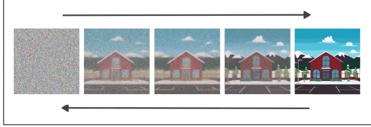

South park [demoura artstyle]"

126 127 In addition, the character diffusion model allows the user to create a 128 south park character based on their own looks via the image-to-image 129 process of stable diffusion and then join the simulation as an equally 130 participating agent. With the ability to clone their own voice, it's easy 131 to imagine a fully realized autonomous character based on the user's 132 characteristic looks, writing style and voice.

133 The second model is trained to generate clean backgrounds, with a

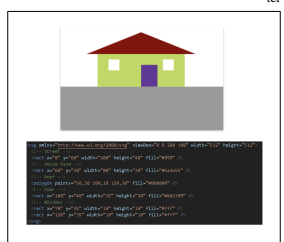

134 particular focus on both exterior and interior environments. This model 135 provides the 'stages' upon which our generated characters can interact, 136 allowing for a wide range of potential scenes and scenarios to be created.

Figure 6: Example of gen-

 erated South Park charac-

ter

Figure 7: GPT-4 generated SVG image, prompt: *"Can you give me a svg drawing of a house on a*

street?"
137 138 However, it's important to note that the images produced by these 139 models are inherently limited in their resolution due to the pixel-based 140 nature of the output. To circumvent this limitation, we post-process the 141 generated images using an AI upscaling technique, specifically R-ESRGAN-4x+-Anime6B, which 142 refines and enhances the image quality. The image generation and upscaling is currently done offline 143 and not on the fly, although they could be in the future as generation speed and quality improve.

144 For future 2D interactive work, training custom transformer based models that are capable of 145 generating vector-based output would have several advantages. Unlike pixel-based images, vector 146 graphics do not lose quality when resized or zoomed, thus offering the potential for infinite resolution. 147 This will enable us to generate images that retain their quality and detail regardless of the scale at 148 which they are viewed. Furthermore, vector based shapes are already separated into individual parts, 149 solving pixel-based post-processing issues with transparency and segmentation which complicate the 150 integration of generated assets into procedural world building and animation systems.

Figure 8: SVGs generated by GPT-4 for the classes automobile, truck, cat, dog.17

# 151 **2 Simulation**

152 Over the past year, we experimented with using simulated data like relationships, personalities,

 153 backstories, character descriptions and more to drive character behavior. Characters chose affordance 154 providers to maintain needs, similar to the SIMs games. We captured those generated events along 155 with the character's details to provide "Reveries" or reflections on each event and their day as a whole. 156 An example is this character, whose backstory includes them being a depressed college student. Their 157 backstory and events combined into the following interpretation from the character of how their day 158 went:

Figure 9: Example of a character reverie.

159 We found there is a natural tension between simulation driven events and narrative driven events or 160 plot. For the South Park experiments, since so much of that material is already familiar to GPT, we 161 only used time of day and the name of the location in the prompt, allowing the results to be mostly 162 plot driven. 163 At present we continue to develop the underlying simulation system to blend daily simulated events 164 as well as narrative plans into a satisfying output. One component of the simulation system is the 165 generation of hundreds of plot templates [see Figure 10] that better fit the context of a fully simulated 166 experience. We will share more details on that in a follow-up paper.

# 167 **3 Episode Generation**

168 We define an episode as a sequence of dialogue scenes in specific locations which add up to a total 169 runtime of a regular 22 min south park episode. 170 In order to generate a full south park episode, we prompt the story system with a high level idea, 171 usually in the form of a synopsis and major events we want to see happen in each of the 14 scenes.

17https://arxiv.org/abs/2303.12712

Figure 10: Example of a plot structure for a simulated escaped convict.

172 From this, the story system can automatically generate a scene (or multiple scenes) by making use of

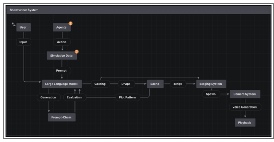 173 simulation data (time of day, zone, character) as part of a prompt chain which first generates a fitting 174 title and as a second step the dialogue of the scene. The showrunner system takes care of spawning the characters for each scene.

Figure 11: Diagram of Showrunner systems and prompt graph

175 176 In the end, each scene simply defines the location, cast and dialogue for each cast member. The scene 177 is played back after the staging system and AI camera system went through initial setup. The voice 178 of each character has been cloned in advance and voice clips are generated on the fly for every new 179 dialogue line.

# 180 **3.1 Reducing Latency**

181 In our experiments, generating a single scene can take a significant amount of time of up to one 182 minute. Below is a response time comparison between GPT-3.5-turbo and GPT-4. Speed will increase 183 in the short-term as models and service infrastructure get improved and other factors like artificial 184 throttling due to high user demand will get removed. 185 Since we generate the scenes during gameplay, we have ways to hide most of the generation time 186 in moments when the user is still interacting with the simulation or other user interfaces. Another 187 way to reduce the time needed to generate a scene is to use faster models such as GPT-3.5-turbo for 188 prompts where the highest quality and accuracy is not so important.

189 During scene playback, we avoid any unwanted pauses between dialogue lines related to audio 190 generation by using a simple buffering system which generates at least one voice clip in advance. 191 See figure 13. This means while one character is delivering their voice clip, we already make the 192 web request for the next voice clip, wait for it to generate, download the file and then wait for the

18Pungas https://www.taivo.ai/gpt−3−5−and−gpt−4−response−*times/*

Figure 12: Speed comparison of GPT-3.5 vs. GPT-418

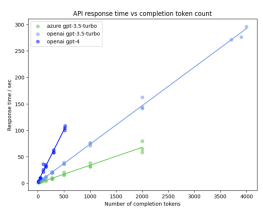

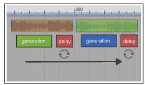

Figure 13: Diagram of zero-delay voice clip generation

# 196 **3.2 Simulate Creative Thinking**

202 In our experiments we tried to mimic a discontinuous creative thought process. For example, the 203 creation of 14 distinct South Park scenes could be achieved by initially providing a broad prompt to 204 outline the general narrative, followed by specific prompts detailing and evaluating each scene's cast, 205 location, and key plot points. This mimics the process of human brainstorming, where ideas are built 206 upon and refined in multiple often discontinuous steps. By leveraging the generative capabilities of 207 LLMs in conjunction with the iterative refinement offered by prompt-chaining, we could in theory 208 construct a dynamic, detailed, and engaging narrative. 209 In addition, we explored new concepts like plot patterns and dramatic operators (DrOps) to enhance 210 the episode structure overall but also the connective tissue between each scene. Stylistic devices 211 like reversals, foreshadowing, cliffhangers are difficult to evaluate as part of a prompt chain. A 212 user without a writing background would have equal difficulty in judging these stylistic devices for 213 their effectiveness and proper placement. We propose a procedural approach, injecting these show 193 current speaker to finish his dialogue before playback (delay). In this way the next dialogue line's 194 voice clip is always delivered without any delay. Text generation and voice cloning services become 195 increasingly fast and allow for highly adaptive and near-real time voice conversations.

197 As stated earlier, the data produced by the simulation acts as creative fuel to both the user who is 198 writing the prompts and the generative story system which is interacting with the LLM. Promptchaining19 199 is a technique, which involves supplying the language model with a sequence of related 200 prompts to simulate a continuous thought process. Sometimes it can take on different roles in each 201 step to act as the discriminator against the previous prompt and generated result.

19Wu https://arxiv.org/abs/2203.06566 20Yank, Auto-GPT for Online Decision Making: Benchmarks and Additional Opinions https://arxiv.org/pdf/2306.02224.pdf

Figure 14: Example of a prompt chain from Auto-GPT20

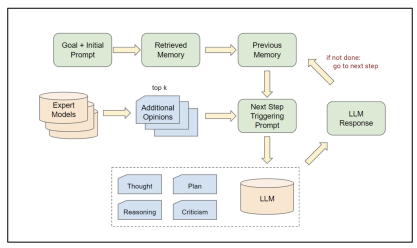

214 specific patterns and stylistic devices into the prompt chain programmatically as plot patterns and

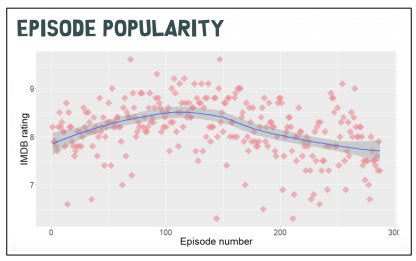 215 DrOps which would operate at the level of act structures, scene structures and individual dialogue 216 lines. We are investigating future opportunities to extract what we call a dramatic fingerprint which 217 is specific to each IP and format and train our custom SHOW-1 model with these data points. This 218 dataset combined with overall human feedback could further align tone, style and entertainment value 219 between the user and the specified IP while offering a highly adaptive and interactive story system as 220 part of the on-going simulation.

Figure 15: Diagram of South Park Episode ratings from IMDB21

# 221 **3.3 Blank Page Problem**

222 As mentioned above, one of the advantages of the simulation is that it avoids the blank page problem for both a user and a large language model by providing creative fuel22 223 . Even experienced writers 224 can sometimes feel overwhelmed when asked to come up with a title or story idea without any prior 225 incubation of related material. The same could be said for LLMs. The simulation provides context 226 and data points before starting the creative process.

21Drhlík, https://pdrhlik.github.io/southparktalk-whyr2018/ 22https://www.trytriggers.com/blog-posts/overcoming-the-barrier-of-the-blank-page

Figure 16: Example UI of Showrunner prompt input

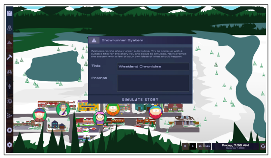

# 227 **3.4 Who Is Driving The Story** 239 **3.5 Show-1 And Intentionality**

228 The story generation process in this proposal is a shared responsibility between the simulation, the 229 user, and GPT-4. Each has strengths and weaknesses and a unique role to play depending on how 230 much we want to involve them in the overall creative process. Their contributions can have different 231 weights. While the simulation usually provides the foundational IP-based context, character histories, 232 emotions, events, and localities that seed the initial creative process. The user introduces their 233 intentionality, exerts behavioral control over the agents and provides the initial prompts that kick off 234 the generative process. The user also serves as the final discriminator, evaluating the generated story 235 content at the end of the process. GPT-4, on the other hand, serves as the main generative engine, 236 creating and extrapolating the scenes and dialogue based on the prompts it receives from both the 237 user and the simulation. It should be a symbiotic process where the strengths of each participant 238 contribute to a coherent, engaging story.

240 The formular (creative characteristics) and format (technical characteristics) of a show are often a 241 function of real-world limitations and production processes. They usually don't change, even over the course of many seasons (South Park currently has 26 seasons and 325 episodes).23 242 243 A single dramatic fingerprint of a show, which is used to train the proposed SHOW-1 model, can be 244 regarded as a highly variable template or "formula" for a procedural generator that produces South 245 Park-like episodes. 246 To train a model such as SHOW-1 we need to gather a sufficient amount of data points in relation to 247 each other that characterize a show. A TV show does not just come into existence and is made up 248 of the final dialogue lines and set descriptions as seen by the audience. Existing datasets on which 249 current LLM's are trained on only consist of the final screenplay which has the cast, dialogue lines 250 and sometimes a short scene header. A lot of information is missing, such as timing, emotional 251 states, themes, contexts discussed in the writer's room and detailed directorial notes to give a few 252 examples. The development and refinement of characters is also part of this on-going process.

253 Fictional characters have personalities, backstories and daily routines which help authors to sculpt 254 not only scenes but the arcs of whole seasons. Even during a show characters keep evolving based 255 on audience feedback or changes in creative direction. With the Simulation, we can gather data

23https://en.wikipedia.org/wiki/SouthP ark
256 continuously from both the user's input and the simulated agents. Over time, as episodes are created, 257 refined and rated by the user we can start to train a show specific model and deploy it in the future 258 as a checkpoint which allows the user to continue to refine and iterate on either their own original 259 show or alternatively push an already existing show such as south park into directions previously 260 not conceived by the original show runners and IP holders. To illustrate this, we imagine a user 261 generating multiple south park episodes in which Cartman, one of the main characters and known 262 for his hot headedness, slowly changes to be shy and naive while the life of other characters such as 263 Butters could be tuned to follow a much more dominant and aggressive path. Over time, this feedback 264 loop of interacting with and fine-tuning the SHOW-1 model could lead to new interpretations of 265 existing shows but more excitingly to new original shows based on the user's intention. One of the 266 challenges in order to make this feedback loop engaging and satisfying is the frequency at which a 267 model can be trained. A model which is fed by real-time simulation data and user input should not 268 feel static or require expensive resources to adapt. Otherwise the output it generates can feel static 269 and unresponsive as well. 270 When a generative system is not limited in its ability to swiftly produce high amounts of content and 271 there is no limit for the user to consume such content immediately and potentially simultaneously, the *10,000 Bowls of Oatmeal*24 272 problem can become an issue. Everything starts to look and feel the 273 same or even worse, the user starts to recognize a pattern which in turn reduces their engagement as 274 they expect newly generated episodes to be like the ones before it, without any surprises.

275 This is quite different from a predictable plot which in combination with the above mentioned 276 "positive hallucinations" or happy accidents of a complex generative system can be a good thing.

277 Surprising the user by balancing and changing the phases of certainty vs. uncertainty helps to increase 278 their overall engagement. If they would not expect or predict anything, they could also not get 279 pleasantly surprised. 280 With our work we aim for perceptual uniqueness. The "oatmeal" problem of procedural generators 281 would be mitigated by making use of an on-going simulation (a hidden generator) and the long-form 282 content of 22 min episodes which should only get generated every 3h. In this way the user generally 283 does not consume a high quantity of content simultaneously or in a very short amount of time. This 284 artificial scarcity, natural game play limits and simulation time help. 285 Another factor that keeps audiences engaged while watching a show and what makes episodes unique 286 is intentionality from the authors. A satirical moral premise, twisted social commentary, recent world 287 events or cameos by celebrities are major elements for South Park. Other show types, for example 288 sitcoms, usually progress mainly through changes in relationship (some of which are never fulfilled), 289 keeping the audience hooked despite following the same format and formula. 290 Intentionality from the user to generate a high-quality episode is another area of internal research. 291 Even users without a background in dramatic writing should be able to come up with stories, themes 292 or major dramatic questions they want to see played out within the simulation. To support this, 293 the showrunner system could guide the user by sharing its own creative thought process and make 294 encouraging suggestions or prompting the user by asking the right questions. A sort of reversed 295 prompt engineering where the user is answering questions. 296 One of the remaining unanswered questions in the context of intentionality is how much entertainment 297 value (or overall creative value) is directly attributed to the creative personas of living authors and 298 directors. Big names usually drive ticket sales but the creative credit the audience gives to the work 299 while consuming it seems different. Watching a Disney movie certainly carries with it a sense of 300 creative quality, regardless of famous voice actors, as a result of brand attachment and its history. 301 AI generated content is generally perceived as lower quality and the fact that it can get generated 302 in abundance further decreases its value. How much this perception would change if Disney were 303 to openly pride themselves on having produced a fully AI generated movie is hard to say. What if 304 Steven Spielberg, single handedly generated an AI movie? Our assumption is that the perceived value 305 of AI generated content would certainly increase. 306 A new interesting approach to replicate this could be the embodiment of creative AI models such 307 as SHOW-1 to allow them to build a persona outside their simulated world and build relationships

24Compton, Procedural Storytelling in Game Design
via social media25 or real world events with their audience. 308 26 As long as an AI model is perceived 309 as a black box and does not share their creative process and reasoning in a human and accessible 310 way, as is the case for living writers and directors, it's unlikely to get credit with real creative values. 311 However, for now this is a more philosophical question in the context of AGI.

# 312 **4 Conclusion**

313 Our approach of using multi-agent simulation and large language models for generating high-quality 314 episodic content provides a novel and effective solution to many of the limitations of current AI 315 systems in creative storytelling. By integrating the strengths of the simulation, the user, and the AI 316 model, we provide a richer and more engaging storytelling experience that is aligned with the IP 317 story world. Our method also mitigates issues such as the 'slot machine effect', 'the oatmeal problem' 318 and 'blank page problem' that plague conventional generative AI systems. As we continue to refine 319 this approach, we are confident that we can further enhance the quality of the generated content, the 320 user experience, and the creative potential of generative AI systems in storytelling. 321 **Acknowledgements** We are grateful to Lewis Hackett for his help and expertise in training the 322 custom Stable Diffusion Models. 323 This is Version 2 - for earlier versions please visit the github page: *https://fablestudio.github.io/* 324 *showrunner-agents/*

# 325 **References**

326 [1] Brockman https://www.hollywoodreporter.com/business/digital/chatgpt-game-of-thrones-openai-greg327 brockman-1235348099/amp/ 328 [2] Maas https://fablesimulation.com/blog/friends-ai-sitcom-simulation 329 [3] Sung Park https://arxiv.org/abs/2304.03442 330 [4] Li https://arxiv.org/abs/2303.17760 331 [5] Maas https://noproscenium.com/from-a-i-character-to-sundance-filmmaker-with-gpt-3-d4ab80c31b4e 332 [6] https://artificial.tech/slot-machine-effect-of-ai/ 333 [7] https://thedecisionlab.com/reference-guide/psychology/intention-action-gap 334 [8] Yang https://arxiv.org/abs/2306.02224 335 [9] Vaswani https://arxiv.org/abs/1706.03762 336 [10] Vaswani https://arxiv.org/abs/1706.03762 337 [11] https://techcommunity.microsoft.com/t5/azure-data-explorer-blog/azure-data-explorer-for-vector-similarity-338 search/ba-p/3819626 339 [12] Bubeck https://arxiv.org/abs/2303.12712 340 [13] Bubeck https://arxiv.org/abs/2303.12712 341 [14] Baker https://openai.com/research/improving-mathematical-reasoning-with-process-supervision 343 [16] Ruiz https://arxiv.org/abs/2208.12242 344 [17] https://arxiv.org/abs/2303.12712
[18] Pungas https://www.taivo.ai/gpt−3−5−and−gpt−4−response−*times/*
345 [19] Wu https://arxiv.org/abs/2203.06566 346 [20] Yank, Auto-GPT for Online Decision Making: Benchmarks and Additional Opinions 347 https://arxiv.org/pdf/2306.02224.pdf [21] Drhlík, https://pdrhlik.github.io/southparktalk-whyr2018 342 [15] Bubeck https://arxiv.org/abs/2303.12712

25Virtual Beings https://www.youtube.com/watch?v=FSq-mheA7Ds, https://www.youtube.com/watch?v=IROZSq–
MQE
26Collaborating with AI at Sundance https://www.fable-studio.com/behind-the-scenes/ai-collaboration
348 [22] https://www.trytriggers.com/blog-posts/overcoming-the-barrier-of-the-blank-page
[23] https://en.wikipedia.org/wiki/SouthP ark 349 [24] Compton, Procedural Storytelling in Game Design 350 [25] Virtual Beings https://www.youtube.com/watch?v=FSq-mheA7Ds, 351 https://www.youtube.com/watch?v=IROZSq–MQE 352 [26] Collaborating with AI at Sundance https://www.fable-studio.com/behind-the-scenes/ai-collaboration