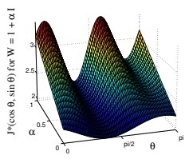
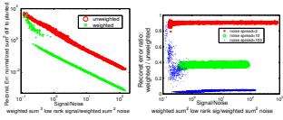
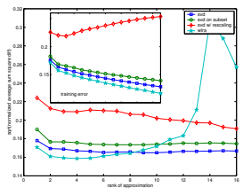
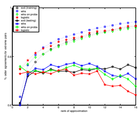

# Weighted Low-Rank Approximations

Nathan Srebro nati@mit.edu Tommi Jaakkola tommi@ai.mit.edu Dept. of Electrical Engineering and Computer Science, Massachusetts Institute of Technology, Cambridge, MA

## Abstract

We study the common problem of approximating a target matrix with a matrix of lower rank. We provide a simple and efficient (EM) algorithm for solving *weighted* low-rank approximation problems, which, unlike their unweighted version, do not admit a closedform solution in general. We analyze, in addition, the nature of locally optimal solutions that arise in this context, demonstrate the utility of accommodating the weights in reconstructing the underlying low-rank representation, and extend the formulation to non-
Gaussian noise models such as logistic models. Finally, we apply the methods developed to a collaborative filtering task.

## 1. Introduction

Factor models are natural in the analysis of many kinds of tabulated data. This includes user preferences over a list of items, microarray (gene expression) measurements, and collections of images. Consider, for example, a dataset of user preferences for movies or jokes. The premise behind a factor model is that there is only a small number of *factors* influencing the preferences, and that a user's preference vector is determined by how each factor applies to that user. In a linear factor model, each factor is a preference vector, and a user's preferences correspond to a linear combination of these factor vectors, with user-specific coefficients. Thus, for n users and d items, the preferences according to a k-factor model are given by the product of an n × k *coefficient matrix* (each row representing the extent to which each factor is used) and a k × d factor matrix whose rows are the factors. The preference matrices which admit such a factorization are matrices of rank at most k. Thus, training such a linear factor model amounts to approximating the empirical preferences with a low-rank matrix.

Low-rank matrix approximation with respect to the Frobenius norm—minimizing the sum squared differences to the target matrix—can be easily solved with Singular Value Decomposition (SVD). For many applications, however, the deviation between the observed matrix and the low-rank approximation should be measured relative to a weighted (or other) norm. While the extension to the weighted-norm case is conceptually straightforward, and dates back to early work on factor analysis (Young, 1940), standard algorithms (such as SVD) for solving the unweighted case do not carry over to the weighted case. Weighted norms can arise in a number of situations. Zero/one weights, for example, arise when some of the entries in the matrix are not observed. More generally, we may introduce weights in response to some external estimate of the noise variance associated with each measurement. This is the case, for example, in gene expression analysis, where the error model for microarray measurements provides entry-specific noise estimates. Setting the weights inversely proportional to the assumed noise variance can lead to a better reconstruction of the underlying structure. In other applications, entries in the target matrix may represent aggregates of many samples. The standard unweighted low-rank approximation (e.g., for separating style and content (Tenenbaum & Freeman, 2000)) would in this context assume that the number of samples is uniform across the entries. Non-uniform weights are needed to appropriately capture any differences in the sample sizes. Despite its usefulness, the weighted extension has attracted relatively little attention. Shpak (1990) and Lu et al. (1997) studied weighted-norm low-rank approximations for the design of two-dimensional digital filters where the weights arise from constraints of varying importance. Shpak developed gradient-based optimization methods while Lu et al. suggested alternatingoptimization methods. In both cases, rank-k approximations are greedily combined from k rank-one approximations. Unlike for the unweighted case, such a greedy procedure is sub-optimal. We suggest optimization methods that are significantly more efficient and simpler to implement (Section 2). We also consider other measures of deviation, beyond weighted Frobenius norms. Such measures arise, for example, when the noise model associated with matrix elements is known but not is Gaussian. For example, for binary data, a logistic model with an underlying low-rank representation might be more appropriate. In Section 3 we show how weighted-norm approximation problems arise as subroutines for solving such a low-rank problem. Finally, in Section 4, we illustrate the use of these methods by applying them to a collaborative filtering problem.

## 2. Weighted Low-Rank Approximations

Given a target matrix A ∈ <n×d, a corresponding nonnegative weight matrix W ∈ <n×d
+ , and a desired (integer) rank k, we would like to find a matrix X ∈ <n×d of rank (at most) k, that minimizes the weighted Frobenius distance J(X) = Pi,a Wi,a (Xi,a − Ai,a)
2. In this section, we analyze this optimization problem and consider optimization methods for it.

#### 2.1. A Matrix-Factorization View

It will be useful to consider the decomposition X =
UV 0 where U ∈ <n×k and V ∈ <d×k. Since any rankk matrix can be decomposed in such a way, and any pair of such matrices yields a rank-k matrix, we can think of the problem as an unconstrained minimization problem over pairs of matrices (*U, V* ) with the minimization objective

$$J(U,V)=\sum_{i,a}W_{i,a}\left(A_{i,a}-(U V^{\prime})_{i,a}\right)^{2}$$  $$=\sum_{i,a}W_{i,a}\left(A_{i,a}-\sum_{\alpha}U_{i,\alpha}V_{a,\alpha}\right)^{2}.$$

This decomposition is not unique. For any invertible R ∈ <k×k, the pair (*UR, V R*−1) provides a factorization equivalent to (U, V ), i.e. J(*U, V* ) = J(*UR, V R*−1),
resulting in a k 2-dimensional manifold of equivalent solutions1. In particular, any (non-degenerate) solution
(*U, V* ) can be orthogonalized to a (non-unique) equivalent orthogonal solution U¯ = UR, V¯ = V R−1such that V¯ 0V¯ = I and U¯0U¯ is a diagonal matrix.2 We first revisit the well-studied case where all weights are equal to one. It is a standard result that the lowrank matrix minimizing the unweighted sum-squared distance to A is given by the leading components of the singular value decomposition of A. It will be instructive to consider this case carefully and understand why the unweighted low-rank approximation has such a clean and easily computable form. We will then be able to move on to the weighted case, and understand how, and why, the situation becomes less favorable. In the unweighted case, the partial derivatives of the objective J with respect to *U, V* are ∂J
∂U 
= 2(UV 0 −
A)V ,
∂J
∂V = 2(V U0 − A0)U. Solving 
∂J
∂U = 0 for U
yields U = AV (V
0V )
−1; focusing on an orthogonal solution, where V
0V = I and U
0U = Λ is diagonal, yields U = AV . Substituting back into ∂J
∂V = 0, we have 0 = V U0U − A0U = V Λ − A0AV . The columns of V are mapped by A0A to multiples of themselves, i.e. they are eigenvectors of A0A. Thus, the gradient
∂J
∂(U,V )
vanishes at an orthogonal (*U, V* ) if and only if the columns of V are eigenvectors of A0A and the columns of U are corresponding eigenvectors of AA0, scaled by the square root of their eigenvalues. More generally, the gradient vanishes at any (U, V ) if and only if the columns of U are spanned by eigenvectors of AA0 and the columns of V are correspondingly spanned by eigenvectors of A0A. In terms of the singular value decomposition A = U0SV 0 0, the gradient vanishes at (U, V ) if and only if there exist matrices Q0UQV = I ∈ <k×k(or more generally, a zero/one diagonal matrix rather than I) such that U = U0SQU , V = V0QV . This provides a complete characterization of the critical points of J. We now turn to identifying the global minimum and understanding the nature of the remaining critical points. The global minimum can be identified by investigating the value of the objective function at the critical points. Let σ1 *≥ · · · ≥* σm be the eigenvalues of A0A. For critical (*U, V* ) that are spanned by eigenvectors corresponding to eigenvalues {σq|q ∈ Q}, the error of J(*U, V* ) is given by the sum of the eigenvalues not in Q (Pq6∈Q σq), and so the global minimum is attained when the eigenvectors corresponding to the highest eigenvalues are taken. As long as there are no repeated eigenvalues, all (*U, V* ) global minima correspond to the same low-rank matrix X = UV 0, and belong to the same equivalence class. 3

1An equivalence class of solutions actually consists of a collection of such manifolds, asymptotically tangent to one another.

2We slightly abuse the standard linear-algebra notion of
"orthogonal" since we cannot always have both U¯0U¯ = I and V¯ 0V¯ = I.

3If there are repeated eigenvalues, the global minima correspond to a polytope of low-rank approximations in X space; in *U, V* space, they form a collection of higherdimensional asymptotically tangent manifolds.
In order to understand the behavior of the objective function, it is important to study the remaining critical points. For a critical point (*U, V* ) spanned by eigenvectors corresponding to eigenvalues as above (assuming no repeated eigenvalues), the Hessian has exactly Pq∈Q q−k2 negative eigenvalues: we can replace any eigencomponent with eigenvalue σ with an alternate eigencomponent not already in (*U, V* ) with eigenvalue σ 0 > σ, decreasing the objective function. The change can be done gradually, replacing the component with a convex combination of the original and improved components. This results in a line between the two critical points which is a monotonic improvement path. Since there are Pq∈Q q −k2 such pairs of eigencomponents, there are at least this many directions of improvement. Other than these directions of improvement, and the k 2 directions along the equivalence manifold corresponding to the k 2zero eigenvalues of the Hessian, all other eigenvalues of the Hessian are positive
(or zero, in very degenerate A). Hence, in the unweighted case, all critical points that are not global minima are saddle points. This is an important observation: Despite J(*U, V* ) not being a convex function, all of its local minima are global. We now move on to the weighted case, and try to take the same path. Unfortunately, when weights are introduced, the critical point structure changes significantly. The partial derivatives become (with ⊗ denoting element-wise multiplication):

$$\begin{array}{l}{{\frac{\partial J}{\partial U}=2(W\otimes(U V^{\prime}-A))V}}\\ {{\frac{\partial J}{\partial V}=2(W\otimes(V U^{\prime}-A^{\prime}))U}}\end{array}$$

The equation ∂J
∂U = 0 is still a linear system in U, and for a fixed V , it can be solved, recovering U
∗
V = arg minU J(U, V ) (since J(*U, V* ) is convex in U). However, the solution cannot be written using a single pseudo-inverse V (V
0V )
−1. Instead, a separate pseudo-inverse is required for each row (U
∗
V)i of U
∗
V:

$$\begin{array}{c}{{(U_{V}^{*})_{i}=(V^{\prime}\underline{{{W_{i}V}}})^{-1}V^{\prime}\underline{{{W_{i}A_{i}}}}}}\\ {{=\mathrm{pinv}(\sqrt{\underline{{{W_{i}V}}}})(\sqrt{\underline{{{W_{i}}}}}A_{i})}}\end{array}$$

where Wi ∈ <k×kis a diagonal matrix with the weights from the i th row of W on the diagonal, and Aiis the i th row of the target matrix4. In order to proceed as in the unweighted case, we would have liked to choose V such that V
0WiV = I (or is at least diagonal). This can certainly be done for a single i, but in order to proceed we need to diagonalize all V
0WiV *concurrently*.

When W is of rank one, such concurrent diagonalization is possible, allowing for the same structure as in the unweighted case, and in particular an eigenvectorbased solution (Irani & Anandan, 2000). However, for higher-rank W, we cannot achieve this concurrently for all rows. The critical points of the weighted low-rank approximation problem, therefore, lack the eigenvector structure of the unweighted case. Another implication of this is that the incremental structure of unweighted low-rank approximations is lost: an optimal rank-k factorization cannot necessarily be extended to an optimal rank-(k + 1) factorization. Lacking an analytic solution, we revert to numerical optimization methods to minimize J(U, V ). But instead of optimizing J(*U, V* ) by numerically searching over (*U, V* ) pairs, we can take advantage of the fact that for a fixed V , we can calculate U
∗
V, and therefore also the projected objective J
∗(V ) = minU J(*U, V* ) =
J(U
∗
V
, V ). The parameter space of J
∗(V ) is of course much smaller than that of J(U, V ), making optimization of J
∗(V ) more tractable. This is especially true in many typical applications where the the dimensions of A are highly skewed, with one dimension several orders of magnitude larger than the other (e.g. in gene expression analysis one often deals with thousands of genes, but only a few dozen experiments). Recovering U
∗
V using (1) requires n inversions of k × k matrices. The dominating factor is actually the matrix multiplications: Each calculation of V
0WiV requires O(dk2) operations, for a total of O(ndk2) operations. Although more involved than the unweighted case, this is still significantly less than the prohibitive O(n 3k 3) required for each iteration suggested by Lu et al. (1997), or for Hessian methods on (*U, V* ) (Shpak, 1990), and is only a factor of k larger than the O(ndk) required just to compute the prediction UV 0.

After recovering U
∗
V, we can easily compute not only the value of the projected objective, but also its gradient. Since 
∂J(V,U)
∂U
U=U∗V
= 0, we have

$$\frac{\partial J^{*}(V)}{\partial V}=\left.\frac{\partial J(V,U)}{\partial V}\right|_{U=U_{V}^{*}}=2(W\otimes(V U_{V}^{*\,\prime}-A^{\prime}))U_{V}^{*}.$$
$$\left(1\right)$$

The computation requires only O(ndk) operations, and is therefore "free" after U
∗
V has been recovered.

Equipped with the above calculations, we can use standard gradient-descent techniques to optimize J
∗(V ).

Unfortunately, though, unlike in the unweighted case, J(U, V ), and J
∗(V ), might have local minima that are not global. Figure 1 shows the emergence of a non-global local minimum of J
∗(V ) for a rank-one approximation of A =1 1.1 1 −1
. The matrix V is a twodimensional vector. But since J
∗(V ) is invariant under

4Here and throughout the paper, rows of matrices, such as Ai and (U
∗V )i, are treated in equations as *column* vectors.
invertible scalings, V can be specified as an angle θ on a semi-circle. We plot the value of J
∗([cos θ,sin θ]) for each θ, and for varying weight matrices of the form W =1+α 1 1 1+α
. At the front of the plot, the weight matrix is uniform and indeed there is only a single local minimum, but at the back of the plot, where the weight matrix emphasizes the diagonal, a non-global local minimum emerges.

Figure 1. Emergence of local minima when the weights become non-uniform.

Despite the abundance of local minima, we found gradient descent methods on J
∗(V ), and in particular conjugate gradient descent, equipped with a long-range line-search for choosing the step size, very effective in avoiding local minima and quickly converging to the global minimum.

### 2.2. A Missing-Values View And An Em Procedure

In this section we present an alternative optimization procedure, which is much simpler to implement. This procedure is based on viewing the weighted lowrank approximation problem as a maximum-likelihood problem with missing values. Consider first systems with only zero/one weights, where only some of the elements of the target matrix A are observed (those with weight one) while others are missing (those with weight zero). Referring to a probabilistic model parameterized by a low-rank matrix X, where A = X + Z and Z is white Gaussian noise, the weighted cost of X is equivalent to the log-likelihood of the observed variables.

This suggests an Expectation-Maximization procedure. In each EM update we would like to find a new parameter matrix maximizing the expected loglikelihood of a filled-in A, where missing values are filled in according to the distribution imposed by the current estimate of X. This maximum-likelihood parameter matrix is the (unweighted) low-rank approximation of the mean filled-in A, which is A with missing values filled in from X. To summarize: in the Expectation step values from the current estimate of X are filled in for the missing values in A, and in the Maximization step X is reestimated as a low-rank approximation of the filled-in A. In order to extend this approach to a general weight matrix, consider a probabilistic system with several target matrices, A(1), A(2)*, . . . , A*(N), but with a single low-rank parameter matrix X, where A(r) = X + Z(r) and the random matrices Z(r) are independent white Gaussian noise with fixed variance. When all target matrices are fully observed, the maximum likelihood setting for X is the low-rank approximation of the their average. Now, if some of the entries of some of the target matrices are not observed, we can use a similar EM procedure, where in the expectation step values from the current estimate of X are filled in for all missing entries in the target matrices, and in the maximization step X is updated to be a low-rank approximation of the mean of the filled-in target matrices. To see how to use the above procedure to solve weighted low-rank approximation problems, consider systems with weights limited to Wia =
wia N with integer wia ∈ {0, 1*, . . . , N*}. Such a low-rank approximation problem can be transformed to a missing value problem of the form above by "observing" the value Aia in wia of the target matrices (for each entry *i, a*),
and leaving the entry as missing in the rest of the target matrices. The EM update then becomes:

$$X^{(t+1)}=\mathrm{LRA}_{k}\left(W\otimes A+({\bf1}-W)\otimes X^{(t)}\right)\quad(2)$$

where LRAk(X) is the unweighted rank-k approximation of X, as can be computed from the SVD. Note that this procedure is independent of N. For any weight matrix (scaled to weights between zero and one) the procedure in equation (2) can thus be seen as an expectation-maximization procedure. This provides for a very simple, tweaking-free method for finding weighted low-rank approximations. Although we found this EM-inspired method effective in many cases, in some other cases the procedure converges to a local minimum which is not global. Since the method is completely deterministic, initialization of X plays a crucial role in promoting convergence to a global, or at least deep local, minimum, as well as the speed with which convergence is attained. Two obvious initialization methods are to initialize X
to A, and to initialize X to zero. Initializing X to A works reasonably well if the weights are bounded away from zero, or if the target values in A have relatively small variance. However, when the weights are zero, or very close to zero, the target values become meaningless, and can throw off the search. Initializing X to zero avoids this problem, as target values with zero weights are completely ignored (as they should be), and works well as long as the weights are fairly dense. However, when the weights are sparse, it often converges to local minima which consistently underpredict the magnitude of the target values. As an alternative to these initialization methods, we found the following procedure very effective: we initialize X to zero, but instead of seeking a rank-k approximation right away, we start with a full rank matrix, and gradually reduce the rank of our approximations. That is, the first d − k iterations take the form:

$$X^{(t+1)}=\mathrm{LRA}_{d-t}\left(W\otimes A+({\bf1}-W)\otimes X^{(t)}\right),\ \ (3)$$

resulting in X(t) of rank (d−t+1). After reaching rank k, we revert back to the iterations of equation (2) until convergence. Note that with iterations of the form X(t+1) = W ⊗A*+ (1*−W)⊗X(t), without rank reductions, we would have X
(t)
ia = (1 − (1 − Wia)
t))Aia →
(1 − e
−tWia )Aia, which converges exponentially fast to A for positive weights. Of course, because of the rank reduction, this does not hold, but even the few high-rank iterations set values with weights away from zero close to their target values, as long as they do not significantly contradict other values.

### 2.3. Reconstruction Experiments

Since the unweighted or simple low-rank approximation problem permits a closed-form solution, one might be tempted to use such a solution even in the presence of non-uniform weights (i.e., ignore the weights). We demonstrate here that this procedure results in a substantial loss of reconstruction accuracy as compared to the EM algorithm designed for the weighted problem. To this end, we generated 1000 × 30 low rank matrices combined with Gaussian noise models to yield the observed (target) matrices. For each matrix entry, the noise variance σ 2 ia was chosen uniformly in some noise level range characterized by a *noise spread ratio* max σ 2/ min σ 2. The planted matrix was subsequently reconstructed using both a weighted low-rank approximation with weights Wia = 1/σ2 ia, and an unweighted low-rank approximation (using SVD). The quality of reconstruction was assessed by an unweighted squared distance from the "planted" matrix.

Figure 2. Reconstruction of a 1000×30 rank-three matrix. Left: (a) weighted and unweighted reconstruction with a noise spread of 100 ; right: (b) reduction in reconstruction error for various noise spreads.

Figure 2(a) shows the quality of reconstruction attained by the two approaches as a function of the signal (weighted variance of planted low-rank matrix) to noise (average noise variance) ratio, for a noise spread ratio of 100 (corresponding to weights in the range 0.01–1). The reconstruction error attained by the weighted approach is generally over twenty times smaller than the error of the unweighted solution. Figure 2(b) shows this improvement in the reconstruction error, in terms of the error ratio between the weighted and unweighted solutions, for the data in Figure 2(a),
as well as for smaller noise spread ratios of ten and two. Even when the noise variances (and hence the weights) are within a factor of two, we still see a consistent ten percent improvement in reconstruction. The weighted low-rank approximations in this experiment were computed using the EM algorithm of Section 2.2. For a wide noise spread, when the lowrank matrix becomes virtually undetectable (a signalto-noise ratio well below one, and reconstruction errors in excess of the variance of the signal), EM often converges to a non-global minimum. This results in weighted low-rank approximations with errors far higher than could otherwise be expected, as can be seen in both figures. In such situations, conjugate gradient descent methods proved far superior in finding the global minimum.

## 3. Low-Rank Logistic Regression

In certain situations we might like to capture a binary data matrix y *∈ {−*1, +1}
n×d with a low-rank model.

A natural choice in this case is a logistic model parameterized by a low-rank matrix X ∈ <n×d, such that Pr (Yia = +1|Xia) = g(Xia) independently for each i, a, where g is the logistic function g(x) = 1 1+e−x . One then seeks a low-rank matrix X maximizing the likelihood Pr (Y = y|X). Such low-rank logistic models were suggested by Collins et al. (2002) and by Gordon
(2003) and recently studied by Schein et al. (2003). Using a weighted low-rank approximation, we can fit a low-rank matrix X minimizing a quadratic loss from the target. In order to fit a non-quadratic loss such as a logistic loss, Loss(Xia; yia) = log g(yiaXia), we use a quadratic approximation to the loss. Consider the second-order Taylor expansion of log g(yx) about ˜x:

$$\log g(y x)\approx$$
 Let $\bar{x}$ be a positive integer,  $\approx\log g(y\bar{x})+y g(-y\bar{x})(x-\bar{x})-\frac{g(y\bar{x})g(-y\bar{x})}{2}\left(x-\bar{x}\right)^2$  $\approx-\frac{g(y\bar{x})g(-y\bar{x})}{2}\left(x-\left(\bar{x}+\frac{y}{g(y\bar{x})}\right)\right)^2+\log g(y\bar{x})+\frac{g(-y\bar{x})}{2g(y\bar{x})}$. 
.
The log-likelihood of a low-rank parameter matrix X can then be approximated as:

$$\log\operatorname*{Pr}\left(y|X\right)\approx1$$
$$\log\Pr\left(y|X\right)\approx$$ $$-\sum_{ia}\frac{g(y_{ia}\tilde{X}_{ia})g(-y_{ia}\tilde{X}_{ia})}{2}\left(X_{ia}-\left(\tilde{X}_{ia}+\frac{y_{ia}}{g(y_{ia}\tilde{X}_{ia})}\right)\right)^{2}$$ $$+\mbox{Const}\quad\mbox{(4)}$$

Maximizing (4) is a weighted low-rank approximation problem. Note that for each entry (*i, a*), we use a second-order expansion about a *different* point X˜ia. The closer the origin X˜ia is to Xia, the better the approximation. This suggests an iterative approach, where in each iteration we find a parameter matrix X using an approximation of the log-likelihood about the parameter matrix found in the previous iteration. For the Taylor expansion, the improvement of the approximation is not always monotonic. This might cause the method outlined above not to converge. In order to provide for a more robust method, we use the following variational bound on the logistic (Jaakkola & Jordan, 2000):

$\begin{array}{c}\log g(yx)\geq\log g(y\bar{x})+\frac{yx-y\bar{x}}{2}-\frac{\tanh(\bar{x}/2)}{4\bar{x}}\left(x^{2}-\bar{x}^{2}\right)\\ =-\frac{1}{4}\frac{\tanh(\bar{x}/2)}{\bar{x}}\left(x-\frac{y\bar{x}}{\tanh(\bar{x}/2)}\right)+\text{Const},\end{array}$  yielding the corresponding bound on the likelihood:
$$\log\Pr\left(y|X\right)\geq$$ $$-\frac{1}{4}\sum_{ia}\frac{\tanh(\bar{X}_{ia}/2)}{\bar{X}_{ia}}\left(X_{ia}-\frac{y_{ia}\bar{X}_{ia}}{\tanh(\bar{X}_{ia}/2)}\right)+\mbox{Const}\tag{5}$$
with equality if and only if X = X˜. This bound suggests an iterative update of the parameter matrix X(t) by seeking a low-rank approximation X(t+1) for the following target and weight matrices:

A (t+1) ia = yia/W(t+1) ia W (t+1) ia = tanh(X (t) ia /2)/X(t) ia
$$(6)$$
Fortunately, we do not need to confront the severe problems associated with nesting iterative optimization methods. In order to increase the likelihood of our logistic model, we do not need to find a lowrank matrix minimizing the objective specified by (6),
just one improving it. Any low-rank matrix X(t+1) with a lower objective value than X(t)(with respect to A(t+1) and W(t+1)) is guaranteed to have a higher likelihood: A lower objective corresponds to a higher upper bound in (5), and since the bound is tight for X(t), the log-likelihood of X(t+1) must be higher than the log-likelihood of X(t). Moreover, if the likelihood of X(t)is not already maximal, there are guaranteed to be matrices with lower objective values. Therefore, we can mix weighted low-rank approximation iterations and logistic bound update iterations, while still ensuring convergence.

In many applications we may also want to associate external weights with each entry in the matrix (e.g. to accommodate missing values), or more generally, weights (counts) of positive and negative observations in each entry (e.g. to capture the likelihood with respect to an empirical distribution). This can easily be done by multiplying the weights in (6) by the external weights, or taking a weighted combination corresponding to y = +1 and y = −1. Note that the target and weight matrices corresponding to the Taylor approximation and those corresponding to the variational bound are different: The variational target is always closer to the current value of X, and the weights are more subtle. This ensures the guaranteed convergence (as discussed above), but the price we pay is a much lower convergence rate. Although we have observed many instances in which a 'Taylor' iteration increases, rather then decreases, the objective, overall convergence was attained much faster using 'Taylor', rather than 'variational' iterations.

## 4. A Collaborative Filtering Example

To illustrate the use of weighted, and generalized, lowrank approximations, we applied our methods to a collaborative filtering problem. The task of collaborative filtering is, given some entries of a user preferences matrix, to predict the remaining entries. We do this by approximating those observed values by a low-rank matrix (using weighted low-rank approximation with zero/one weights). Unobserved values are predicted according to the learned low-rank matrix. Using low-rank approximation for collaborative filtering has been suggested in the past. Goldberg et al. (2001) use a low-rank approximation of a fullyobserved subset of columns of the matrix, thus avoiding the need to introduce weights. Billsus and Pazzani (1998) use a singular value decomposition of a sparse binary observation matrix. Both Goldberg and Billsus use the low-rank approximation only as a preprocessing step, and then use clustering (Goldberg) and neural networks (Billsus) to learn the preferences. Azar et al. (2001) proved asymptotic consistency of a method in which unobserved entries are replaced by zeros, and observed entries are scaled inversely proportionally to the probability of them being observed. No guarantees are provided for finite data sets, and to the best of our knowledge this technique has not been experimentally tested.

We analyzed a subset of the Jester data5(Goldberg et al., 2001). The data set contains one hundred jokes, with user ratings (bounded continuous values entered by clicking an on-screen "funniness" bar) for some of the jokes. All users rated a core set of ten jokes, and most users rated an extended core set of a total of twenty jokes. Each user also rated a variable number of additional jokes. We selected at random one thousand users who rated the extended core set and at least two additional jokes. For each user, we selected at random two non-core jokes and held out their ratings. We fit low-rank matrices using the following techniques: svd Unobserved values were replaced with zeros, and the unweighted low-rank approximation to the resulting matrix was sought.

subset An unweighted low-rank approximation for the core subset of jokes was sought (similarly to Goldberg's initial step). The matrix was extended to the remaining jokes by projecting each joke column onto the column subspace of this matrix.

rescaling Following Azar et al. (2001), the ratings for each joke were scaled inversely proportional to the frequency with which the joke was rated (between 0.197 and 0.77). An unweighted lowrank approximation for the resulting matrix was sought.

wlra A weight of one was assigned to each observed joke, and a weight of zero to each unobserved joke, and a weighted low-rank approximation was sought using gradient descent techniques.

For each low-rank matrix, the test error on the held out jokes (Figure 3) and the training error were measured in terms of the average squared difference to the true rating, scaled by the possible range of ratings. Normalized mean absolute error (NMAE) was also measured, producing very similar results, with no qualitative dif-

Figure 3. Prediction errors on Jester jokes: test error (main figure) and training error (insert).

ferences. Beyond the consistent reduction in training error (which is guaranteed by the optimization objective), we observe that wlra achieves a better test error than any of the other methods. Not surprisingly, it also over-fits much more quickly, as it becomes possible to approximate the observed values better at the expense of extreme values in the other entries.

Figure 4. Training (dotted lines) and test performance on Jester jokes.

As discussed in the introduction, minimizing the squared error to the absolute ratings is not necessarily the correct objective. Taking the view that each joke has a 'probability of being funny' for each user, we proceeded to try to fit a low-rank logistic regression model. We first transformed the raw observed values into 'funniness' probabilities by fitting a mixture model with two equal-variance Gaussian components to each user's ratings, and using the resulting component-posterior probabilities. This procedure

5The data set was kindly provided by Ken Goldberg.
also ensures scale and transformation invariability for a user's ratings, and places more emphasis on users with a bimodal rating distribution than on users for which all ratings are clustered together. We proceeded to fit a low-rank logistic model (q.v. Section 3) using the observed posterior probabilities as empirical probabilities. Since the resulting low-rank model no longer predicts the absolute rating of jokes, we measured success by analyzing the relative ranking of jokes by each user. Specifically, for each user we held out one noncore joke which was rated among the top quarter by the user, and one non-core joke which was rated in the bottom quarter. We then measured the frequency with which the relative rankings of the predictions on these two jokes was consistent with the true relative ranking. Using this measure, we compared the logistic low-rank model to the sum-squared error methods discussed above, applied to both the absolute ratings (as above) and the probabilities. Figure 4 shows the training and test performance of the logistic method, the wlra method applied to the ratings, the wlra method applied to the probabilities, and the svd method applied to the ratings (all other methods tested perform worse than those shown). Although the results indicate that the wlra method performs better than the logistic method, it is interesting to note that for small ranks, k = 2, 3, the training performance of the logistic model is better—in these cases the logistic view allows us to better capture the rankings than a sumsquared-error view (Schein et al. (2003) investigates the training error of other data sets, and arrives at similar conclusions). A possible modification to the logistic model that might make it more suitable for such tasks is the introduction of label noise.

## 5. Conclusion

We have provided simple and efficient algorithms for solving weighted low-rank approximation problems. The EM algorithm is extremely simple to implement, and works well in some cases. In more complex cases, conjugate gradient descent on J
∗(V ) provides efficient convergence, usually to the global minimum. Weighted low-rank approximation problems are important in their own right and appear as subroutines in solving a class of more general low-rank problems. One such problem, fitting a low-rank logistic model, was developed in this paper. Similar approaches can be used for other convex loss functions with a bounded Hessian. Another class of problems that we can solve using weighted low-rank approximation as a subroutine is low-rank approximation with respect to a mixtureof-Gaussians noise model. This application will be

## References

Azar, Y., Fiat, A., Karlin, A. R., McSherry, F., & Saia, J. (2001). Spectral analysis of data. Proceedings of the Thirty Third ACM Symposium on Theory of Computing.

Billsus, D., & Pazzani, M. J. (1998). Learning collaborative information filters. *Proceedings of 15th* International Conference on Machine Learning.

Collins, M., Dasgupta, S., & Schapire, R. (2002). A
generalization of principal component analysis to the exponential family. Advances in Neural Information Processing Systems 14.

Goldberg, K., Roeder, T., Gupta, D., & Perkins, C.

(2001). Eigentaste: A constant time collaborative filtering algorithm. *Information Retrieval*, 4, 133– 151.

Gordon, G. (2003). Generalized2linear2 models. Advances in Neural Information Processing Systems 15.

Irani, M., & Anandan, P. (2000). Factorization with uncertainty. Proceedings of the Sixth European Conference on Computer Vision.

Jaakkola, T., & Jordan, M. (2000). Bayesian parameter estimation via variational methods. Statistics and Computing, 10, 25–37.

Lu, W.-S., Pei, S.-C., & Wang, P.-H. (1997). Weighted low-rank approximation of general complex matrices and its application in the design of 2-D digital filters. IEEE Transactions on Circuits and Systems—I, 44, 650–655.

Schein, A. I., Saul, L. K., & Ungar, L. H. (2003).

A generalized linear model for principal component analysis of binary data. Proceedings of the Ninth International Workshop on Artificial Intelligence and Statistics.

Shpak, D. (1990). A weighted-least-squares matrix decomposition method with application to the design of two-dimensional digital filters. IEEE Thirty Third Midwest Symposium on Circuits and Systems.

Tenenbaum, J. B., & Freeman, W. T. (2000). Separating style and content with bilinear models. *Neural* Computation, 12, 1247–1283.

Young, G. (1940). Maximum likelihood estimation and factor analysis. *Psychometrika*, 6, 49–53.