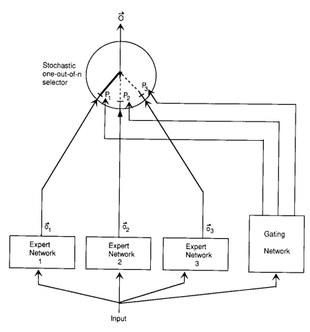
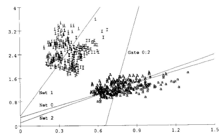
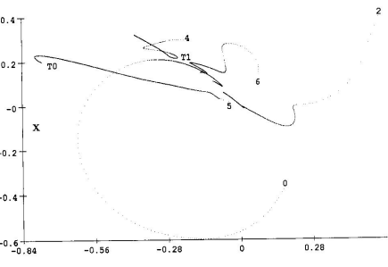

In Neural Computation, 3, pages **79-87.**
Adaptive Mixtures of Local **Experts**
Robert A. **Jacobs** Michael I. **Jordan**
Department of Brain & Cognitive **Sciences**
Massachusetts Institute of **Technology**
Cambridge, MA **02139**
Steven J. **Nowlan**
Geoffrey E. **Hinton**
Department of Computer **Science**
University of **Toronto**
Toronto, Canada M5S 1A4

## Abstract

We present a new supervised learning procedure for systems composed of many **separate**
networks, each of which learns to handle a subset of the complete set of training **cases.**
The new procedure can be viewed either as a modular version of a multilayer **supervised** network, or as an associative version of competitive learning. It therefore provides a new link between these two apparently different approaches. We demonstrate that the **learning** procedure divides up a vowel discrimination task into appropriate subtasks, each of **which** can be solved by a very simple expert **network.**

## 1 Making Associative Learning **Competitive**

If backpropagation is used to train a single, multilayer network to perform different **subtasks** on different occasions, there will generally be strong interference effects which lead to **slow** learning and poor generalization. If we know in advance that a set of training cases may be naturally divided into subsets that correspond to distinct subtasks, interference can be reduced by using a system composed of several different "expert" networks plus a **gating**
network that decides which of the experts should be used for each training case. 1 **Hampshire**

#### 

1

1This idea was first presented by Jacobs and Hinton at the Connectionist Summer School in **Pittsburgh**
in **1988.**
and Waibel (1989) have described a system of this kind that can be used when the **division** into subtasks is known prior to training, and Jacobs, Jordan and Barto (1990) have **described**
a related system that learns how to allocate cases to experts. The idea behind such a **system**
is that the gating network allocates a new case to one or a few experts, and, if the **output** is incorrect, the weight changes are localized to these experts (and the gating network). So **there** is no interference with the weights of other experts that specialize in quite different **cases.** The experts are therefore local in the sense that the weights in one expert are **decoupled** from the weights in other experts. In addition they will often be local in the sense that **each** expert will be allocated to only a small local region of the space of possible input **vectors.**
Unfortunately, both Hampshire and Waibel and Jacobs et al. use an error function **which**
does not encourage localization. They assume that the final output of the whole **system** is a linear combination of the outputs of the local experts, with the gating network **determining** the proportion of each local output in the linear combination. So the final error on **case** c is

$$E^{c}=\|\vec{d^{c}}-\sum_{i}p_{i}^{c}\vec{o}_{i}^{c}\|^{2}$$
i
$$(1)$$

2(1)
where ~o c iis the output vector of expert i on **case** c, p ciis the proportional **contribution** of expert i to the combined output vector, and ~d cis the desired output vector in **case** c.

This error measure compares the desired output with a blend of the outputs of the **local**
experts, so, to minimize the error, each local expert must make its output cancel the **residual** error that is left by the combined effects of all the other experts. When the weights in one expert change, the residual error changes, and so the error derivatives for all the other **local** experts **change.** 
2 This strong coupling between the experts causes them to cooperate **nicely,**
but tends to lead to solutions in which many experts are used for each case. It is **possible** to encourage competition by adding penalty terms to the objective function to **encourage** solutions in which only one expert is active (Jacobs, Jordan, and Barto, 1990), but a **simpler** remedy is to redefine the error function so that the local experts are encouraged to **compete** rather than **cooperate.**
Instead of linearly combining the outputs of the separate experts, we imagine that the gating network makes a stochastic decision about which single expert to use on each **occasion** (see figure 1). The error is then the expected value of the squared difference between the desired and actual output **vectors**

2For Hampshire and Waibel, this problem does not arise because they do not learn the task **decomposition.**
They train each **expert** separately on its own pre-assigned **subtask.**

Figure 1: A system of expert and gating networks. Each expert is a feedforward network and all experts receive the same input and have the same number of outputs.  The gating network is also feedforward and typically receives the same input as the expert networks.

It has normalized outputs p; = exp(x;}/ ∑;exp(x;), where x; is the total weighted input received by output unit j of the gating network.  The selector acts like a multiple input, single output stochastic switch; the probability that the switch will select the output from expert j is pj.

$$(2)$$

$$E^{c}=<\!\!\|\vec{d}^{\vec{c}}-\vec{o}_{i}^{c}\|^{2}\!\!>\;=\sum_{i}p_{i}^{c}\|\vec{d}^{\vec{c}}-\vec{o}_{i}^{c}\|^{2}$$

co Notice that in this new error function, each expert is required to produce the **whole** of the output vector rather than a residual. As a result, the goal of a local expert on a **given** training case is not directly affected by the weights within other local experts. There is **still** some indirect coupling because if some other expert changes its weights, it may cause the gating network to alter the responsibilities that get assigned to the experts, but at **least** these responsibility changes cannot alter the sign of the error that a local expert **senses** on a given training case. If both the gating network and the local experts are **trained** by gradient descent in this new error function, the system tends to devote a single **expert** to each training case. Whenever an expert gives less error than the weighted average of the errors of all the experts (using the outputs of the gating network to decide how to **weight** each expert's error) its responsibility for that case will be increased, and whenever it **does** worse than the weighted average its responsibility will be **decreased.**
The error function in equation 2 works in practice but in the simulations reported **below**
we used a different error function which gives better **performance:**

$$E^{c}=-\log\sum_{i}p_{i}^{c}e^{-\frac{1}{2}\|\vec{d}^{\vec{c}}-\vec{d}_{i}^{c}\|^{2}}\tag{3}$$

The error defined in equation 3 is simply the negative log probability of generating the desired output vector under the mixture of gaussians model described at the end of the **next** section. To see why this error function works better, it is helpful to compare the **derivatives** of the two error functions with respect to the output of an expert. From equation 2 we get

$$\frac{\partial E^{c}}{\partial\vec{o}_{i}^{c}}=-2p_{i}^{c}(\vec{d}^{\vec{c}}-\vec{o}_{i}^{c})\tag{1}$$

while from equation 3 we get

$$\frac{\partial E^{c}}{\partial\sigma_{i}^{c}}=-\left[\frac{p_{i}^{c}e^{-\frac{1}{2}\|\vec{d}^{c}-\vec{\sigma}_{i}^{c}\|^{2}}}{\sum_{j}p_{j}^{c}e^{-\frac{1}{2}\|\vec{d}^{c}-\vec{\sigma}_{j}^{c}\|^{2}}}\right](\vec{d}^{\vec{E}}-\vec{\sigma}_{i}^{c})\tag{5}$$
$$\left(4\right)$$

In equation 4 the **term** p c iis used to weight the derivative for expert i. In equation 5 we use a weighting term that takes into account how well expert i does relative to other **experts.** This is a more useful measure of the relevance of expert i to training case c, especially **early** in the training. Suppose, for example, that the gating network initially gives equal **weights**
to all experts and k~d c − ~o c i k > 1 for all the experts. Equation 4 will adapt the **best-fitting**
expert the slowest, whereas equation 5 will adapt it the **fastest.**
4

# 2 Making Competitive Learning **Associative**

It is natural to think that the "data" vectors on which a competitive network is **trained**
play a role similar to the input vectors of an associative network that maps input **vectors**
to output vectors. This correspondence is assumed in models that use competitive **learning** as a preprocessing stage within an associative network (Moody and Darken, 1989). A **quite** different view is that the data vectors used in competitive learning correspond to the output vectors of an associative network. The competitive network can then be **viewed** as an inputless stochastic generator of output vectors and competitive learning can be **viewed** as a procedure for making the network generate output vectors with a distribution that **matches** the distribution of the "data" vectors. The weight vector of each competitive hidden **unit** represents the mean of a multidimensional gaussian distribution, and output vectors are generated by first picking a hidden unit and then picking an output vector from the **gaussian** distribution determined by the weight vector of the chosen hidden unit. The log **probability** of generating any particular output **vector** ~o cis **then**

$$\log P^{c}=\log\sum_{i}p_{i}k e^{-\frac{1}{2}\|\vec{\mu}_{i}-\vec{\sigma}^{c}\|^{2}}$$
$\left(\vec{0}\right)$. 

(6)

where i is an index over the hidden units, µ~iis the "weight" vector of the hidden **unit,** k is a normalizing constant, and piis the probability of picking hidden unit i, so the pi are constrained to sum to 1. In the statistics literature (McLachlan and Basford, 1988), the pi are called "mixing **proportions".**
"Soft" competitive learning modifies the weights (and also the variances and the **mixing**
proportions) so as to increase the product of the probabilities (i.e. the likelihood) of generating the output vectors in the training set (Nowlan, 1990). "Hard" competitive **learning** is a simple approximation to soft competitive learning in which we ignore the possibility **that** a data vector could be generated by several different hidden units. Instead, we assume **that** it must be generated by the hidden unit with the closest weight vector, so only this **weight** vector needs to be modified to increase the probability of generating the data **vector.**
If we view a competitive network as generating output vectors, it is not **immediately**
obvious what role input vectors could play. However, competitive learning can be **generalized** in much the same way as Barto (1985) has generalized learning automata by **adding** an input vector and making the actions of the automaton be conditional on the input **vector.** We replace each hidden unit in a competitive network by an entire expert network **whose** output vector specifies the mean of a multidimensional gaussian distribution. So the **means**

### 5

are now a function of the current input vector and are represented by activity levels **rather** than weights. In addition, we use a gating network which allows the mixing **proportions** of the experts to be determined by the input vector. This gives us a system of competing **local** experts with the error function defined in equation 3. We could also introduce a **mechanism** to allow the input vector to dynamically determine the covariance matrix for the **distribution** defined by each expert network, but we have not yet experimented with this **possibility.**

## 3 Application To Multi-Speaker Vowel **Recognition**

The mixture of experts model was evaluated on a speaker independent, four-class, **vowel** discrimination problem. The data consisted of the first and second formants of the vowels **[i],**
[I], [a], and [A] (usually denoted [Λ]) from 75 speakers (males, females and children) **uttered**
in a hVd context (Peterson & Barney, 1952). The data forms two pairs of **overlapping** classes, and different experts learn to concentrate on one pair of classes or the other **(figure** 2).

We compared standard back-propagation networks containing a single hidden **layer** of 6 or 12 units with mixtures of 4 or 8 very simple experts. The architecture of each **expert** was restricted so it could form only a linear decision surface which is defined as the set of input vectors for which the expert gives an output of exactly 0.5. All models were **trained** with data from the first 50 speakers and tested with data from the remaining 25 **speakers.** The small number of parameters for each expert allows excellent generalization **performance** (table 1), and permits a graphical representation of the process of task decomposition **(figure** 3). The number of hidden units in the back propagation networks was chosen to give **roughly** equal numbers of parameters for the back propagation networks and mixture models. All simulations were performed using a simple gradient descent algorithm with fixed step **size** .

To simplify the comparisons, no momentum or other acceleration techniques were used. The value of  for each system was chosen by performing a limited exploration of the **convergence** from the same initial conditions for a range of . Batch training was used with one **weight** update for each pass through the training set (epoch). Each system was trained **until** an average squared error of 0.08 over the training set was **obtained.**
The mixtures of experts reach the error criterion significantly faster than the backpropagation networks (p  0.999), requiring only about half as many epochs on **average** (table 1). The learning time for the mixture model also scales well as the number of **experts** is increased: The mixture of 8 experts has a small, but statistically significant (p > 0.**95),** advantage in the average number of epochs required to reach the error criterion. In **contrast,**

### 6

Figure 2: Data for vowel discrimination problem, and expert and gating network **decision**

 lines. The horizontal axis is the first formant value, and the vertical axis is the **second** formant value (the formant values have been linearly scaled by dividing by a factor of **1000).** Each example is labelled with its corresponding vowel symbol. Vowels [i] and [I] form one overlapping pair of classes, vowels [a] and [A] form the other pair. The lines labelled Net 0, 1 and 2 represent the decision lines for 3 expert networks. On one side of these lines the output of the corresponding expert is less than 0.5, on the other side the output is **greater** than 0.5. Although the mixture in this case contained 4 experts, one of these experts **made** no significant contribution to the final mixture since its mixing proportion pi was **effectively** 0 for all cases. The line labelled Gate 0:2 indicates the decision between expert 0 and **expert** 2 made by the gating network. To the left of this line p2 > p0, to the right of this **line** p0 > p2. The boundary between classes [a] and [A] is formed by the combination of the **left** part of Net 2's decision line and the right part of Net 0's decision line. Although the **system** tends to use as few experts as it can to solve a problem, it is also sensitive to specific **problem** features such as the slightly curved boundary between classes [a] and **[A].**

7

|    | System   |     | Train   | %   | Correct   | Test   | % Correct   | Avg. #   | Epochs   | Std.   | Dev.   |
|----|----------|-----|---------|-----|-----------|--------|-------------|----------|----------|--------|--------|
| 4  | Experts  |     |         | 88  |           |        | 90          | 1124     |          | 23     |        |
| 8  | Experts  |     |         | 88  |           |        | 90          | 1083     |          | 12     |        |
| BP | 6        | Hid |         | 88  |           |        | 90          | 2209     |          | 83     |        |
| BP | 12       | Hid |         | 88  |           |        | 90          | 2435     |          | 124    |        |

Table 1: Summary of performance on vowel discrimination task. Results are **based** on 25 simulations for each of the alternative models. The first column of the table indicates the system simulated. The second column gives the percent of training cases classified **correctly** by the final set of weights, while the third column indicates the percent of testing **cases** classified correctly. The last two columns contain the average number of epochs **required** to reach the error criterion, and the standard deviation of the distribution of **convergence** times. Although the squared error was used to decide when to stop training, the **criterion** for correct performance is based on a weighted average of the outputs of all the **experts.** Each expert assigns a probability distribution over the classes and these distributions are combined using proportions given by the gating network. The most probable class is **then**
taken to be the response of the system. The identical performance of all the systems is due to the fact that, with this dataset, the set of misclassified examples is not sensitive to **small** changes in the decision surfaces. Also, the test set is easier than the training **set.**

Figure 3: The trajectories of the decision lines of some experts during one simulation. The

 horizontal axis is the first formant value, and the vertical axis is the second formant **value.** Each trajectory is represented by a sequence of dots, one per epoch, each dot marking the intersection of the expert's decision line and the normal to that line passing through the origin. For clarity, only 5 of the 8 experts are shown and the number of the expert is **shown**
at the start of the trajectory. The point labelled T0 indicates the optimal decision line for a single expert trained to discriminate [i] from [I]. Similarly, T1 represents the optimal **decision** line to discriminate [a] from [A]. The point labelled X is the decision line learned by a **single**
expert trained with data from all 4 classes, and represents a type of average **solution.**

the 12 hidden unit back-propagation network requires more epochs (p > 0.95) to reach the error criterion than the network with 6 hidden units (table 1). All statistical **comparisons**
are based on a t-test with 48 degrees of freedom and a pooled variance **estimator.**
Figure 3 shows how the decision lines of different experts move around as the **system**
learns to allocate pieces of the task to different experts. The system begins in an **unbiased** state, with the gating network assigning equal mixing proportions to all experts in all **cases.** As a result, each expert tends to get errors from roughly equal numbers of cases in all 4 classes, and all experts head towards the point X, which represents the optimal **decision** line for an expert that must deal with all the cases. Once one or more experts **begin** to receive more error from cases in one class pair than the other, this symmetry is broken and the trajectories begin to diverge as different experts concentrate on one class pair or the other. In this simulation, expert 5 learns to concentrate on discriminating classes [i] and
[I] so its decision line approaches the optimal line for this discrimination (T0). **Experts** 4 and 6 both concentrate on discriminating classes [a] and [A], so their trajectories **approach**
the optimal single line (T1) and then split to form a piecewise linear approximation to the slightly curved optimal decision surface (see figure 2). Only experts 4, 5, and 6 are **active** in the final mixture. This solution is typical - in all simulations with mixtures of 4 or 8 **experts** all but 2 or 3 experts had mixing proportions that were effectively 0 for all **cases.**

# Acknowledgements

Jordan and Jacobs were funded by grants from Siemens and the McDonnell-Pew **program**
in Cognitive Neuroscience. Hinton and Nowlan were funded by grants from the **Ontario** Information Technology Research Center and the Canadian Natural Science and **Engineering** Research Council. Hinton is a fellow of the Canadian Institute for Advanced **Research.**

### References

Barto, A. G. (1985) Learning by statistical cooperation of self-interested neuron-like computing elements. Human Neurobiology, **4:229–256.** Hampshire, J. and Waibel, A. (1989) The Meta-Pi network: Building distributed **knowledge** representations for robust pattern recognition, Technical Report CMU-CS-89-166, **Carnegie** Mellon University, Pittsburgh, PA. Jacobs, R.A. & Jordan, M.I. (1991) Learning piecewise control strategies in a modular connectionist architecture, in **preparation**. Jacobs, R. A., Jordan, M. I. and Barto, A. G. (1991) Task decomposition through competition in a modular connectionist architecture: The what and where vision tasks. **Cognitive** Science, in **press**. McLachlan, G. J. and Basford, K. E. (1988) Mixture models: Inference and **applications** to clustering. Marcel Dekker, **Inc.**
Moody, J. and Darken, C. (1989) Fast learning in networks of locally-tuned processing **units.**
Neural Computation, 1**(2):281–294.**
Nowlan, S. J. (1990) Maximum Likelihood Competitive Learning. In D. S. Touretzky **(ed.),**
Advances in Neural Information Processing Systems 2, pp. 574-582. San Mateo, CA: **Morgan**
Kaufmann. Nowlan, S. J. (1990) Competing experts: An experimental investigation of associative mixture models. Technical Report CRG-TR-90-5, University of Toronto, Toronto, **Canada.** Peterson, G. E. and Barney, H. L. (1952) Control Methods Used in a Study of the **Vowels,** J. Acoust. Soc. Am., vol. 24, pp. **175-184.**